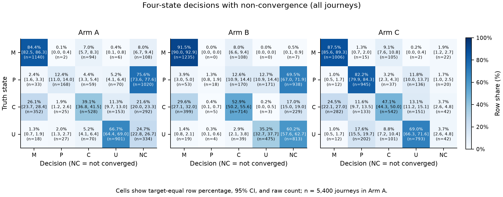
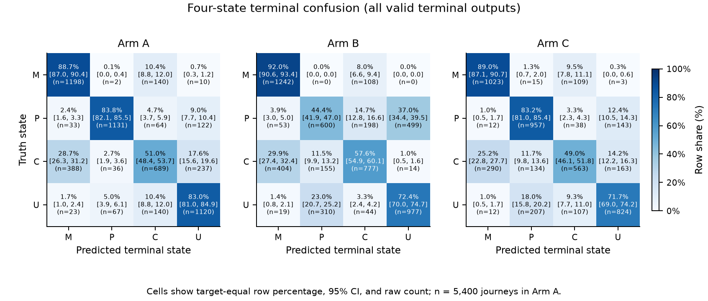
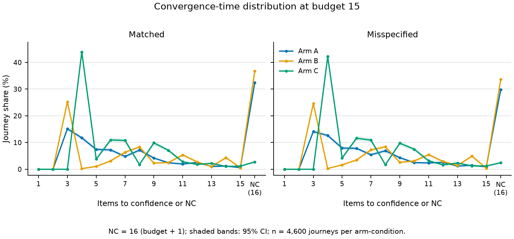
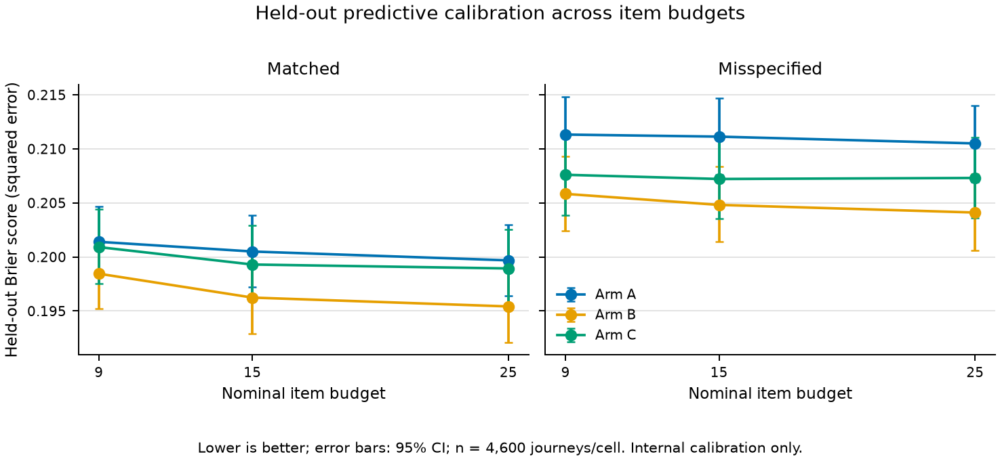
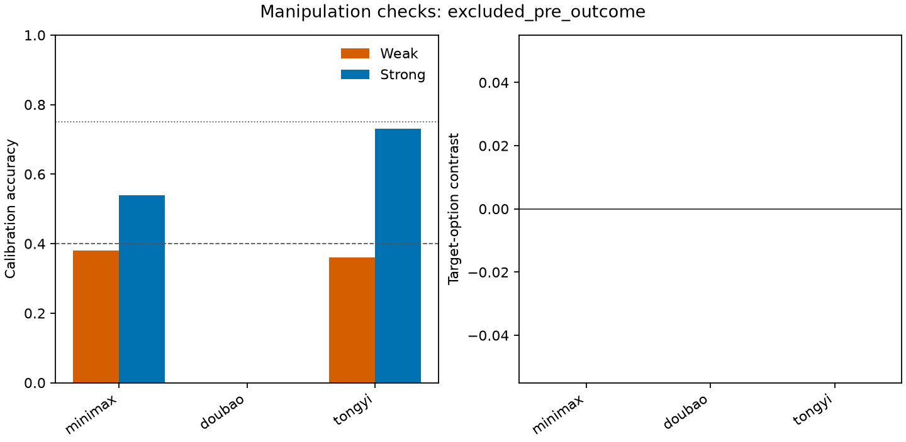
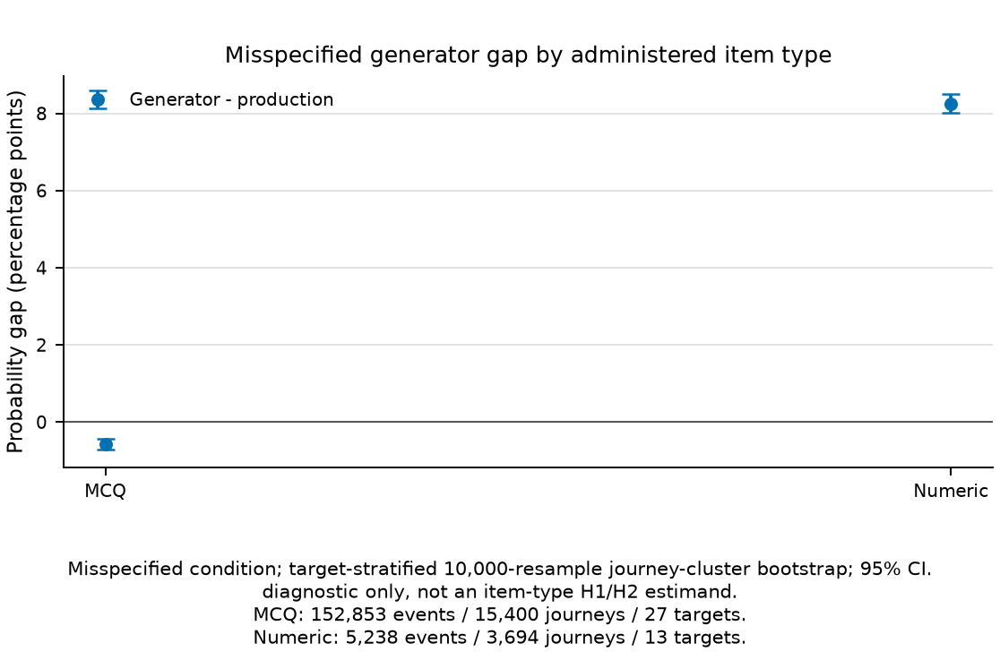
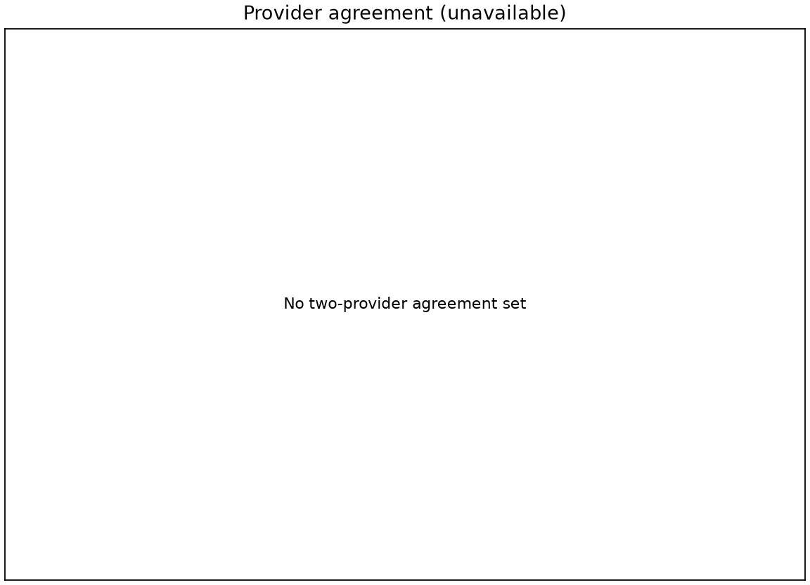
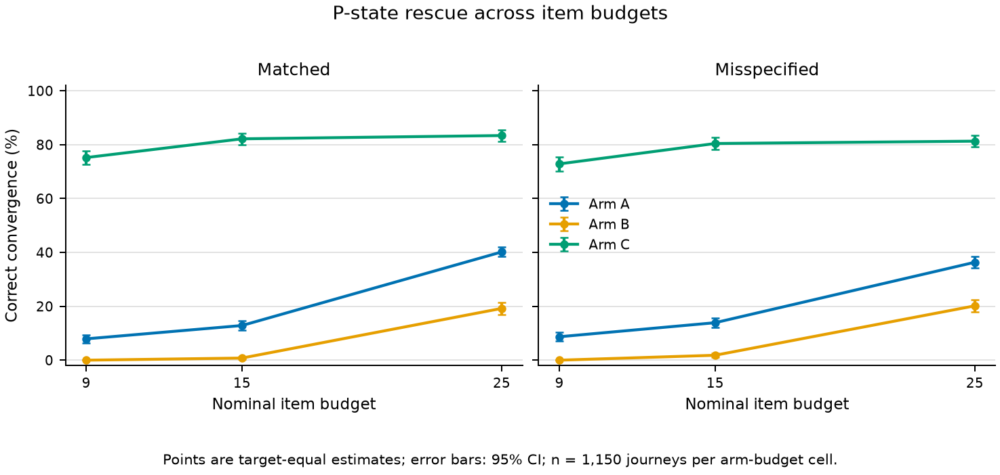

# Diagnosing Why a Student Is Wrong Under Item Budgets

## A Confirmatory Evaluation Protocol for Prerequisite-Probe Timing in High-School Chemistry

<!-- BEGIN PAPER GENERATED STATUS -->
**Manuscript status:** confirmatory result binding complete; H1-H4 were evaluated and H5 was excluded pre-outcome with machine-bound evidence. All result values and decisions in the generated sections come from the validated machine contract.
<!-- END PAPER GENERATED STATUS -->

## Abstract

An adaptive diagnostic system can often estimate whether a student will answer a
target-concept question correctly. A harder problem is to distinguish *why* the
student is likely to fail. YHer represents a student's state at one chemistry concept
as mastered (M), prerequisite gap (P), chain instability (C), or unlearned target
knowledge (U). Under the current binary response channel, local target questions make
P and U only weakly distinguishable within short sessions: their production
correct-response probabilities differ by 0.10. They are nevertheless asymptotically
identifiable under the model, so this work makes no claim of structural, mathematical,
or asymptotic non-identifiability. It studies **budget-limited weak identifiability**,
or **practical non-identifiability at the pre-specified budgets of 9, 15, and 25
items**.

A hypothesis-generating T0 pilot on synthetic difficulty grids suggested that
prerequisite questions could rescue P-state diagnosis, while inserting them at a
fixed quota could increase C-state misdiagnosis. The confirmatory design therefore
compares three policies on the trusted production catalog and unmodified production
inference engine: belief-triggered expected information gain (A), a fixed local-item
difficulty ladder (B), and the same ladder with a prerequisite item at every third
position (C). It pairs response noise and held-out outcomes across arms, reports
matched and deliberately misspecified response generators separately, and freezes
analysis populations, stopping rules, seeds, outcomes, and hypothesis decisions
before collection. A secondary, separately gated study uses LLM-simulated personas;
it is not evidence about human learners. Confirmatory conclusions are admitted only
through the machine-generated results contract.

<!-- BEGIN PAPER GENERATED ABSTRACT FINDINGS EN -->
**Confirmatory findings.** H1=partially_supported (complete); H2=not_supported (complete); H3=supported (complete); H4=supported (complete); H5=not evaluated (excluded pre-outcome). H1 A rate=0.128696; rescue 95% CI=[0.103478, 0.138261]. H2 harm 95% CI=[0.023478, 0.089565]; no-harm 95% CI=[0.072174, 0.122609]. These are simulated finite-budget results, not evidence of human learning or educational efficacy.
<!-- END PAPER GENERATED ABSTRACT FINDINGS EN -->

## 1. Introduction

### 1.1 From correctness to cause

Educational software commonly observes answers, scores them, and recommends the next
item. That loop can still fail a student if the same wrong answer is compatible with
different causes. A student may lack a prerequisite, understand the components but
lose the reasoning chain, or have little target knowledge at all. Those causes imply
different next actions. A prerequisite gap calls for an earlier concept; chain
instability calls for a worked causal bridge; an unlearned concept calls for a direct
introduction.

YHer is a pre-alpha, local high-school chemistry system built around this distinction.
Its narrow product loop is: diagnose one concept, route to an existing teacher video
or constrained explanation, administer independent practice and held-out questions,
and update an event-reconstructable student profile. The system does not claim
learning gains, long-term efficacy, or human validation. This paper isolates one
measurement question inside that loop: under a fixed item budget and a binary response
channel, when should the system ask a prerequisite question?

### 1.2 The measurement problem

For a target-local item of difficulty \(d\), the production model uses the state-wise
correct-response vector

\[
P(Y=1 \mid M,P,C,U) = (0.90,\ \gamma+0.10,\ 0.70-0.20d,\ \gamma),
\]

where \(\gamma=0.25\) for multiple-choice items and \(0.03\) for numeric items. P and
U therefore differ locally by 0.10. Given unlimited independent observations under
the model, that difference is enough for asymptotic identification. Under 9, 15, or
25 observations, however, posterior evidence may be too weak to produce a correct,
confident P classification. A prerequisite item uses a different likelihood vector,

\[
P(Y_{pre}=1 \mid M,P,C,U) = (0.90,\ \gamma,\ 0.80,\ 0.75),
\]

and can separate P from U more strongly. The same item may be harmful when asked of a
true C student because C, M, and U all have high prerequisite-correct probabilities.
The research question is therefore about *probe timing*, not whether prerequisite
items are universally useful.

### 1.3 Research questions and scope

The primary questions are:

1. At the pre-specified budgets, does a belief-triggered prerequisite policy improve
   correct P convergence over a local-only fixed ladder?
2. Does fixed-quota prerequisite insertion increase C-state misdiagnosis relative to
   belief-triggered selection, while belief-triggered selection avoids material harm
   relative to the local-only ladder?

Adaptive item selection itself is established prior art. The intended contribution is
not a new CAT algorithm. It is a pre-data, production-bound evaluation of whether a
four-cause diagnostic state can be distinguished under limited binary evidence, and
whether two prerequisite-probe timing policies have different failure profiles.

### 1.4 Contributions

This work contributes:

- a bounded four-state diagnostic formulation tied to an operational chemistry loop;
- a three-arm comparison that separates the value of a probe from the policy that
  schedules it;
- paired held-out and misspecification protocols that expose internal calibration and
  model-dependence rather than hiding them;
- a frozen, hash-bound execution and analysis contract in which negative results are
  reportable outcomes; and
- a secondary LLM-persona protocol with manipulation checks and explicit separation
  from claims about human students.

## 2. Related Work

### 2.1 Computerized adaptive testing

Tailored and computerized adaptive testing long predates this project. Lord's
Robbins-Monro formulation, Weiss's work on measurement efficiency, and Weiss and
Kingsbury's educational applications establish the core premise that item selection
can improve measurement efficiency [@lord1971; @weiss1982;
@weiss-kingsbury1984]. Simulation is also a standard method for examining CAT item
selection rules [@barrada2010; @han2018]. YHer therefore treats adaptive selection and
simulation as prior art. Its narrower question concerns a causal state distinction
that depends on cross-node prerequisite evidence and may remain weak within a fixed
budget even when each arm uses legitimate item selection.

### 2.2 Learner modeling and knowledge tracing

Bayesian knowledge tracing models the acquisition of procedural knowledge over time
[@corbett-anderson1994], and later work compares BKT with logistic and related learner
models [@pelanek2017]. YHer borrows Bayesian updating, but the confirmatory study is
not a knowledge-acquisition model. It holds one latent truth state fixed during a
single diagnostic journey and asks whether an observation policy can recover it. The
study therefore does not validate longitudinal learning tracking, transition
parameters, or a general student model.

### 2.3 Spaced repetition

Spaced-repetition research studies review scheduling and memory dynamics
[@tabibian2019; @ye2022]. YHer's product profile contains an **FSRS-inspired**
stability and decay projection, informed operationally by the official FSRS software
repository and Anki documentation [@fsrs-repository; @anki-fsrs-manual]. FSRS is
software rather than a peer-reviewed source in this bibliography, and neither the
software nor the cited scheduling papers validate YHer's particular decay formula.
The confirmatory experiment starts from a uniform belief and advances simulated time
only within one session; it does not evaluate spaced-repetition efficacy.

### 2.4 LLM-simulated students

Recent work uses LLM-simulated students to evaluate questions, tutoring agents, and
behavior across learner profiles [@lu-wang2024; @liu2024; @jin2025; @wu2025;
@scarlatos2025]. Work directly questioning whether simulated tutoring behavior has
substance rather than surface plausibility reinforces the need for validation gates
[@scarlatos2026]. In this study, LLM personas are secondary. They must pass declared
accuracy-band and misconception-level manipulation checks, and provider cells must
meet completion thresholds. Even a successful LLM-persona analysis would show
cross-provider behavior under prompts, not human validity or educational efficacy.

All citation metadata and verified links are stored in
[`references.json`](references.json).

## 3. System

### 3.1 Product boundary

YHer's current wedge is Shanghai high-school chemistry. The knowledge graph contains
135 nodes, but the trusted deterministic catalog opens 27 nodes for the diagnostic
loop. The S0 prerequisite census mechanically admits 23 of those nodes to the H1/H2
analysis set and records four prerequisite-free nodes as exclusions from those two
hypotheses. The full descriptive and H3 grid retains all 27.

The source pool is gated by the R5 service ledger. A question must also have a trusted
mapping, a verified answer, deterministic scoring, no required unresolved media, and
a content-family identity before it enters the confirmatory catalog. Two local
families per target are reserved for held-out scoring and removed from every
administered pool.

### 3.2 Five production engines

The system separates five concerns:

1. **Mastery** maintains the M/P/C/U posterior, applies production likelihoods, and
   contains the FSRS-inspired memory projection used outside the static experiment.
2. **Selector** scores eligible items by expected information gain (EIG), applies
   holdout and seen-item gates, and calls the production stopping rule.
3. **Planner** maps 30-, 60-, and 120-minute product modes to bounded diagnostic,
   learning, and verification work. The 30-minute product mode is explicitly shallow.
4. **Recommender** ranks existing video segments using profile, purpose, diagnosis,
   content fit, signed track metadata, and seen-segment exclusions.
5. **Memory** admits selected high-value events and supports reconstruction from the
   append-only event history.

The confirmatory runner imports the production mastery and selector modules. It does
not reimplement Bayesian updating, EIG, or convergence.

### 3.3 Evidence separation

The product service freezes diagnostic, practice, and held-out partitions at both
item and content-family levels. Scoring keys remain server-side. Held-out responses
are independent evidence in the product; in the programmatic study, held-out outcomes
are paired across arms and never passed into posterior updating. Matched held-out
Brier is an internal calibration check only.

## 4. Hypothesis-Generating Pilot

T0 was run on 2026-07-08 before the production-bound confirmatory study. It used
synthetic difficulty grids, a uniform prior, 4,000 simulated students per cell, and
the then-specified production likelihood constants. It did not use the real R5 item
distribution or the final production selector. Its purpose was to reveal failure
modes and generate hypotheses; its values are not pooled with confirmatory estimates.

In the binary local-item condition, C-state correct convergence at nine items ranged
from 13.9% to 34.7% across the pilot difficulty settings, reached 45.1% to 61.3% at
15 items, and reached 58.4% to 70.1% at 25. For P at medium difficulty, correct
convergence was 0.0% at both 9 and 15 items in that pilot. Replacing three of nine
local items with fixed-position prerequisite items increased pilot P correct
convergence from 0.0% to 73.9%. The same fixed quota increased C misdiagnosis from
26.8% to 46.1% while leaving C correct convergence nearly unchanged.

These pilot observations motivated H1 and H2. They do not prove either hypothesis.
The pilot used a fixed prerequisite quota as a stress comparison, not the final
belief-triggered policy, and its idealized generator shared important assumptions
with inference. The source report and raw pilot table are
`/Users/mac/Desktop/项目文件夹/Tools/scratchpad/T0_dosimetry_report.md` and
`/Users/mac/Desktop/项目文件夹/Tools/scratchpad/t0_results.json`.

## 5. Confirmatory Method

### 5.1 Frozen hypotheses

- **H1, P-state rescue:** at budget 15 under the matched generator, Arm A reaches at
  least 0.50 P correct convergence and the 95% confidence interval for A minus B lies
  strictly above zero. The ordered partial/not-supported branches are frozen.
- **H2, probe-policy harm:** at budget 9, the 95% interval for C minus A C-state
  misdiagnosis lies above zero, while the upper interval bound for A minus B lies
  below the +0.05 no-harm margin.
- **H3, adaptive sanity check:** Arm A is compared with B on overall terminal accuracy
  and convergence time. This is subordinate because adaptive testing is prior art.
- **H4, misspecification:** the H1 rescue and H2 harm point directions are checked
  under the frozen misspecified generator, with all degradation reported.
- **H5, LLM personas:** provider coverage, weak/strong accuracy bands, and a
  misconception-hit contrast determine whether secondary cross-provider behavior is
  reportable.

The exact ordered decision rules are canonical in
[`experiments/analysis_plan.md`](../../experiments/analysis_plan.md#hypothesis-decisions).

### 5.2 Grid and pairing

The programmatic intention-to-simulate grid contains 27 targets, four truth states,
three arms, 50 replicates, and two generator conditions: 32,400 journeys. One
maximum-25-item trajectory supplies views at nominal budgets 9, 15, and 25. When a
journey reaches confidence early, its posterior and convergence time carry forward
without inflating the actual administered count.

A paired unit is target x truth x generator condition x replicate. Arms share the
response-noise stream. The two held-out family outcomes are generated without an arm
component in their seeds, so all three arms receive the same held-out outcomes.

### 5.3 Arms

- **A, belief-triggered EIG:** calls production `selector.select_next` at every
  administered decision. Eligible prerequisite candidates compete with local items.
- **B, fixed local ladder:** cycles requested difficulties 0.25, 0.50, 0.75, and 1.00
  and serves local items only.
- **C, fixed quota:** uses B's ladder but replaces positions 3, 6, 9, ..., 24 with
  prerequisite items.

Fixed-arm ties use `(absolute difficulty distance, family_id, item_id)`. All arms use
family-epoch replenishment after exhausting unseen eligible families; for B and C,
the frozen fixed-selection tuple continues to govern choices within that constraint.
Every arm calls production `mastery.observe` for each observation and production
`selector.should_stop` after each update. At item 25, a second call with budget 26
separates confidence convergence from budget exhaustion.

### 5.4 Generators and inference separation

The matched generator samples from production response probabilities. The
misspecified generator draws item-level slip from U[0.05, 0.20], guess from
U[0.15, 0.35] for every item type, and one replicate-level Normal(0, 0.05) ability
offset clipped to [-0.10, 0.10]. Inference keeps the unmodified production constants.
Generator parameters never enter the likelihood update.

The misspecified arm reduces, but cannot eliminate, circularity between the simulator
and inference model. It remains a synthetic stress test and is reported separately
from matched results and by item type.

### 5.5 Analysis sets and sparse pools

H1/H2 primary estimates use the mechanically eligible 23-target set. The required
empirical with-replacement stress estimand preserves all eligible targets and reports
exact-item and family repeats. A second, pre-outcome sensitivity estimand uses a
budget-specific common-support set on which all three arms can complete without
family repetition. Neither result may be suppressed because it is less favorable.

### 5.6 Outcomes and intervals

At each nominal budget, the analysis reports correct convergence, converged
misdiagnosis, terminal argmax accuracy, a four-state confusion matrix, convergence
time, held-out Brier, actual item count, and repeat metrics. Severe M-to-U or U-to-M
misdiagnosis is reported over all terminal outputs and separately over converged
outputs.

Intervals use exactly 10,000 target-stratified percentile bootstrap resamples. Within
each target, replicate IDs are resampled with replacement while paired arms remain
paired. Contrasts are computed inside each resample. The paper reports numerators,
denominators, effects, and intervals rather than relying on a naked p-value.

### 5.7 Isolation and provenance

Every raw event, journey, shard manifest, and run manifest is marked simulated and
contains a persona ID, provider, and model ID. The runner binds an annotated tag,
runner commit, current and historical analysis-plan commits, canonical config hash,
seeds, engine and input hashes, and a truthful run-start timestamp. Data execution
requires bytecode writes to be disabled from process start. A shard becomes resumable
only after a protected-filesystem guard attests that designated paths were unchanged
during that computation window. These per-shard attestations do not establish global
byte identity across the full wall-clock run: a concurrent test wrote `.pytest_cache`
between batches. The isolation evidence therefore supports no protected-path writes
during each guarded computation window, not continuous zero-write across the entire
interval.

## 6. Results Contract

<!-- BEGIN PAPER GENERATED RESULTS -->
The table and audit records below are generated directly from the validated results contract. No confirmatory value in this section is hand-entered.

**Machine exclusion disclosure.** 1,600 intended journeys were excluded from every estimand. Reasons: `structural_failure` (1,600). Arms: Arm C (1,600). Affected targets: `化学计量（摩尔/阿伏伽德罗）`, `原子结构`, `基本操作`, `物质分类`.

**Machine post-collection static audit policy.** The independently reviewed conditional-metric rule records undefined target/draw denominators as NA, uses no denominator redraw, and discloses attempted and defined bootstrap iterations. This clarification was adopted from static review, not from any result direction; the binder verified policy artifact `static_audit_policy.json`.

**H5 excluded-cell disclosure.** 12 excluded provider cells and 464 excluded persona cells.

**H5 provider lifecycle disclosure.** Of the six frozen providers: invalid calibration schema=3; invalid provider artifact=0; missing=0; missing required revision=0; network interruption=1; model-drift exclusion=0; provider-configuration exclusion=0; pre-outcome design exclusion=0; technical interruption=0; post-calibration exclusion=2; other collected=0. Invalid, missing, interrupted, and post-calibration-excluded providers do not enter qualifying-provider metrics. Immutable evidence is bound in `h5/h5_results.json`.

**H5 provider identities by lifecycle.** invalid calibration schema: `deepseek`, `glm`, `kimi`; network interruption: `doubao`; post calibration exclusion: `minimax`, `tongyi`. Immutable evidence is bound in `h5/h5_results.json`.

**Machine item-type generator diagnostic.** Because administered journeys are mixed trajectories, these probability-gap summaries are generator diagnostics, not item-type H1/H2 outcome estimands. MCQ gap=-0.005756; 95% CI [-0.007220, -0.004277]; 152,853 events / 15,400 journeys / 27 targets. Numeric gap=0.082579; 95% CI [0.080117, 0.085107]; 5,238 events / 3,694 journeys / 13 targets.

| Hypothesis | Analysis status | Decision | Machine branch |
|---|---|---|---|
| H1 | complete | partially_supported | `mixed` |
| H2 | complete | not_supported | `a_inferior` |
| H3 | complete | supported | `supported` |
| H4 | complete | supported | `supported` |
| H5 | excluded pre-outcome | not evaluated | `excluded_pre_outcome` |

### Machine display records

**H1.**
- result `H1_P_A_CORRECT_CONVERGENCE_MATCHED_B15_ELIGIBLE_STRESS` / registry `p_rescue.full.matched.b15.arm_A`: value=0.128696; ci95=[0.112174, 0.145217]; numerator=148; denominator=1150; n_target=23; n_pair=1150.
- result `H1_P_B_CORRECT_CONVERGENCE_MATCHED_B15_ELIGIBLE_STRESS` / registry `p_rescue.full.matched.b15.arm_B`: value=0.007826; ci95=[0.003478, 0.013043]; numerator=9; denominator=1150; n_target=23; n_pair=1150.
- result `H1_P_A_MINUS_B_CORRECT_CONVERGENCE_MATCHED_B15_ELIGIBLE_STRESS` / registry `h1.primary.matched.b15.rescue_A_minus_B`: value=0.120870; ci95=[0.103478, 0.138261]; numerator=139; denominator=1150; n_target=23; n_pair=1150.
- result `H1_P_A_MINUS_B_CORRECT_CONVERGENCE_MATCHED_B15_ELIGIBLE_STRESS_CI95` / registry `h1.primary.matched.b15.rescue_A_minus_B`: value=[0.103478, 0.138261]; numerator=139; denominator=1150; n_target=23; n_pair=1150.
- result `H1_P_A_CORRECT_CONVERGENCE_MATCHED_B15_COMMON_SUPPORT` / registry `h1.no_repeat.matched.b15.arm_A`: value=0.005000; ci95=[0, 0.015000]; numerator=1; denominator=200; n_target=4; n_pair=200.
- result `H1_P_B_CORRECT_CONVERGENCE_MATCHED_B15_COMMON_SUPPORT` / registry `h1.no_repeat.matched.b15.arm_B`: value=0; ci95=[0, 0]; numerator=0; denominator=200; n_target=4; n_pair=200.
- result `H1_P_A_MINUS_B_CORRECT_CONVERGENCE_MATCHED_B15_COMMON_SUPPORT` / registry `h1.no_repeat.matched.b15.rescue_A_minus_B`: value=0.005000; ci95=[0, 0.015000]; numerator=1; denominator=200; n_target=4; n_pair=200.
- result `H1_P_A_MINUS_B_CORRECT_CONVERGENCE_MATCHED_B15_COMMON_SUPPORT_CI95` / registry `h1.no_repeat.matched.b15.rescue_A_minus_B`: value=[0, 0.015000]; numerator=1; denominator=200; n_target=4; n_pair=200.

**H2.**
- result `H2_C_A_MISDIAGNOSIS_MATCHED_B9_ELIGIBLE_STRESS` / registry `c_misdiagnosis.full.matched.b9.arm_A`: value=0.373913; ci95=[0.346087, 0.401739]; numerator=430; denominator=1150; n_target=23; n_pair=1150.
- result `H2_C_B_MISDIAGNOSIS_MATCHED_B9_ELIGIBLE_STRESS` / registry `c_misdiagnosis.full.matched.b9.arm_B`: value=0.276522; ci95=[0.250435, 0.302609]; numerator=318; denominator=1150; n_target=23; n_pair=1150.
- result `H2_C_C_MISDIAGNOSIS_MATCHED_B9_ELIGIBLE_STRESS` / registry `c_misdiagnosis.full.matched.b9.arm_C`: value=0.430435; ci95=[0.401739, 0.459130]; numerator=495; denominator=1150; n_target=23; n_pair=1150.
- result `H2_C_A_MISDIAGNOSIS_MATCHED_B9_COMMON_SUPPORT` / registry `h2.no_repeat.matched.b9.arm_A`: value=0.417778; ci95=[0.373333, 0.462222]; numerator=188; denominator=450; n_target=9; n_pair=450.
- result `H2_C_B_MISDIAGNOSIS_MATCHED_B9_COMMON_SUPPORT` / registry `h2.no_repeat.matched.b9.arm_B`: value=0.284444; ci95=[0.242222, 0.326667]; numerator=128; denominator=450; n_target=9; n_pair=450.
- result `H2_C_C_MISDIAGNOSIS_MATCHED_B9_COMMON_SUPPORT` / registry `h2.no_repeat.matched.b9.arm_C`: value=0.437778; ci95=[0.393333, 0.482222]; numerator=197; denominator=450; n_target=9; n_pair=450.
- result `H2_C_C_MINUS_A_MISDIAGNOSIS_MATCHED_B9_ELIGIBLE_STRESS` / registry `h2.primary.matched.b9.harm_C_minus_A`: value=0.056522; ci95=[0.023478, 0.089565]; numerator=65; denominator=1150; n_target=23; n_pair=1150.
- result `H2_C_C_MINUS_A_MISDIAGNOSIS_MATCHED_B9_ELIGIBLE_STRESS_CI95` / registry `h2.primary.matched.b9.harm_C_minus_A`: value=[0.023478, 0.089565]; numerator=65; denominator=1150; n_target=23; n_pair=1150.
- result `H2_C_A_MINUS_B_MISDIAGNOSIS_MATCHED_B9_ELIGIBLE_STRESS` / registry `h2.primary.matched.b9.no_harm_A_minus_B`: value=0.097391; ci95=[0.072174, 0.122609]; numerator=112; denominator=1150; n_target=23; n_pair=1150.
- result `H2_C_A_MINUS_B_MISDIAGNOSIS_MATCHED_B9_ELIGIBLE_STRESS_CI95` / registry `h2.primary.matched.b9.no_harm_A_minus_B`: value=[0.072174, 0.122609]; numerator=112; denominator=1150; n_target=23; n_pair=1150.
- result `H2_C_C_MINUS_A_MISDIAGNOSIS_MATCHED_B9_COMMON_SUPPORT` / registry `h2.no_repeat.matched.b9.harm_C_minus_A`: value=0.020000; ci95=[-0.033333, 0.075556]; numerator=9; denominator=450; n_target=9; n_pair=450.
- result `H2_C_C_MINUS_A_MISDIAGNOSIS_MATCHED_B9_COMMON_SUPPORT_CI95` / registry `h2.no_repeat.matched.b9.harm_C_minus_A`: value=[-0.033333, 0.075556]; numerator=9; denominator=450; n_target=9; n_pair=450.
- result `H2_C_A_MINUS_B_MISDIAGNOSIS_MATCHED_B9_COMMON_SUPPORT` / registry `h2.no_repeat.matched.b9.no_harm_A_minus_B`: value=0.133333; ci95=[0.091111, 0.175556]; numerator=60; denominator=450; n_target=9; n_pair=450.
- result `H2_C_A_MINUS_B_MISDIAGNOSIS_MATCHED_B9_COMMON_SUPPORT_CI95` / registry `h2.no_repeat.matched.b9.no_harm_A_minus_B`: value=[0.091111, 0.175556]; numerator=60; denominator=450; n_target=9; n_pair=450.

**H3.**
- result `H3_A_MINUS_B_TERMINAL_ACCURACY_MATCHED_B15_FULL_SET` / registry `h3.matched.b15.terminal_accuracy_A_minus_B`: value=0.100370; ci95=[0.088889, 0.111852]; numerator=542; denominator=5400; n_target=27; n_pair=5400.
- result `H3_A_MINUS_B_TERMINAL_ACCURACY_MATCHED_B15_FULL_SET_CI95` / registry `h3.matched.b15.terminal_accuracy_A_minus_B`: value=[0.088889, 0.111852]; numerator=542; denominator=5400; n_target=27; n_pair=5400.
- result `H3_A_MEDIAN_CONVERGENCE_ITEMS_MATCHED_B15_FULL_SET` / registry `h3.matched.b15.time_to_confidence.arm_A`: value=8; ci95=[8, 8]; numerator=50613; denominator=5400; n_target=27; n_pair=5400.
- result `H3_B_MEDIAN_CONVERGENCE_ITEMS_MATCHED_B15_FULL_SET` / registry `h3.matched.b15.time_to_confidence.arm_B`: value=11; ci95=[10, 11]; numerator=55139; denominator=5400; n_target=27; n_pair=5400.

**H4.**
- result `H4_H1_RESCUE_MISSPECIFIED_B15_ELIGIBLE_STRESS` / registry `h4.misspecified.b15.rescue_A_minus_B`: value=0.120870; ci95=[0.101739, 0.140000]; numerator=139; denominator=1150; n_target=23; n_pair=1150.
- result `H4_H2_HARM_MISSPECIFIED_B9_ELIGIBLE_STRESS` / registry `h4.misspecified.b9.harm_C_minus_A`: value=0.069565; ci95=[0.036522, 0.102609]; numerator=80; denominator=1150; n_target=23; n_pair=1150.
- result `H4_H1_MATCHED_TO_MISSPECIFIED_DEGRADATION` / registry `h4.degradation.h1_rescue.matched_minus_misspecified`: value=0.000000; ci95=[-0.026087, 0.025217]; numerator=0; denominator=1150; n_target=23; n_pair=1150.
- result `H4_H2_MATCHED_TO_MISSPECIFIED_DEGRADATION` / registry `h4.degradation.h2_harm.matched_minus_misspecified`: value=-0.013043; ci95=[-0.060000, 0.034783]; numerator=-15; denominator=1150; n_target=23; n_pair=1150.
- result `H4_H2_NO_HARM_MISSPECIFIED_B9_ELIGIBLE_STRESS` / registry `h4.misspecified.b9.no_harm_A_minus_B`: value=0.080870; ci95=[0.054783, 0.106957]; numerator=93; denominator=1150; n_target=23; n_pair=1150.
- result `H4_H2_NO_HARM_MATCHED_TO_MISSPECIFIED_DEGRADATION` / registry `h4.degradation.h2_no_harm.matched_minus_misspecified`: value=0.016522; ci95=[-0.020870, 0.053043]; numerator=19; denominator=1150; n_target=23; n_pair=1150.
- result `H4_H1_RESCUE_MISSPECIFIED_B15_COMMON_SUPPORT` / registry `h1.no_repeat.misspecified.b15.rescue_A_minus_B`: value=0.005000; ci95=[0, 0.015000]; numerator=1; denominator=200; n_target=4; n_pair=200.
- result `H4_H1_RESCUE_MISSPECIFIED_B15_COMMON_SUPPORT_CI95` / registry `h1.no_repeat.misspecified.b15.rescue_A_minus_B`: value=[0, 0.015000]; numerator=1; denominator=200; n_target=4; n_pair=200.
- result `H4_H2_HARM_MISSPECIFIED_B9_COMMON_SUPPORT` / registry `h2.no_repeat.misspecified.b9.harm_C_minus_A`: value=0.028889; ci95=[-0.022222, 0.080056]; numerator=13; denominator=450; n_target=9; n_pair=450.
- result `H4_H2_HARM_MISSPECIFIED_B9_COMMON_SUPPORT_CI95` / registry `h2.no_repeat.misspecified.b9.harm_C_minus_A`: value=[-0.022222, 0.080056]; numerator=13; denominator=450; n_target=9; n_pair=450.
- result `H4_H2_A_MINUS_B_MISDIAGNOSIS_MISSPECIFIED_B9_COMMON_SUPPORT` / registry `h2.no_repeat.misspecified.b9.no_harm_A_minus_B`: value=0.113333; ci95=[0.068889, 0.160000]; numerator=51; denominator=450; n_target=9; n_pair=450.
- result `H4_H2_A_MINUS_B_MISDIAGNOSIS_MISSPECIFIED_B9_COMMON_SUPPORT_CI95` / registry `h2.no_repeat.misspecified.b9.no_harm_A_minus_B`: value=[0.068889, 0.160000]; numerator=51; denominator=450; n_target=9; n_pair=450.
- result `H4_MCQ_GENERATOR_MINUS_PRODUCTION_MISSPECIFIED_DIAGNOSTIC` / registry `misspecification.item_type.mcq.generator_minus_production`: value=-0.005756; ci95=[-0.007220, -0.004277]; numerator=-869.942501; denominator=152853; n_target=27; n_pair=15400.
- result `H4_NUMERIC_GENERATOR_MINUS_PRODUCTION_MISSPECIFIED_DIAGNOSTIC` / registry `misspecification.item_type.numeric.generator_minus_production`: value=0.082579; ci95=[0.080117, 0.085107]; numerator=550.308891; denominator=5238; n_target=13; n_pair=3694.

**H5.**
No outcome estimate was generated because the analysis was excluded pre-outcome; the decision table records this as not evaluated.

Source artifact: `metric_registry.json` (`sha256:3493b2687cecaa91b0ef7ae25f0dacdaa3ea05a5405c79a4321814d5fa092a7c`). Publication PNG bytes were copied only after contract hash verification.

### Verified publication figures

<!-- END PAPER GENERATED RESULTS -->

## 7. Discussion

<!-- BEGIN PAPER GENERATED DISCUSSION -->
**H1.** The frozen P-state rescue criterion was partially supported. Some required evidence favored rescue, but the full conjunction did not pass; the paper therefore makes no full-support claim.

**H2.** The criterion was not supported. The fixed-quota harm contrast remained positive, but the belief-triggered arm failed the no-harm requirement relative to the local-only arm; this is not a reversal of the fixed-quota pattern.

**H3.** The subordinate adaptive sanity check was supported. It remains secondary because adaptive-testing efficiency is established prior art.

**H4.** Under the frozen misspecification stress, both predicted directions persisted. This result describes sensitivity to one declared perturbation family and cannot establish behavioral realism.

**H5.** The LLM-persona hypothesis was excluded pre-outcome because its machine mapping gate was unavailable. It was not evaluated and is not reported as a negative finding.

These findings remain limited to simulated, finite-budget diagnosis in the tested catalog. They do not establish structural non-identifiability, human validity, learning gains, or educational efficacy.
<!-- END PAPER GENERATED DISCUSSION -->

## 8. Contribution Statement and AI Use

This project uses a three-layer responsibility model.

**Student responsibility.** The student set the product direction, narrowed scope to
chemistry, defined the diagnostic-versus-recommendation boundary, requested a re-review
with academic value as the priority, and commissioned the frozen v2 route. The
decision-layer synthesis proposed the finite-budget state and probe-policy framing;
the student approved that route and set the pre-outcome honesty and quality gates.
Dated evidence is indexed in
[`decision_log.md`](decision_log.md), especially D11, with repository-local anchors in
the [`2026-07-13 18:01` overview entry](../../../PROJECT_HANDOFF/YHER_PROJECT_OVERVIEW.md)
and the [frozen v2 brief](../../../PROJECT_HANDOFF/codex_briefs/2026-07-13_仿真评估实验与论文总攻.md).

**AI-assisted work under review gates.** AI systems proposed designs, implemented
code and automation, executed the simulation and analysis, drafted the current result
interpretation and prose, generated tests, and performed adversarial reviews. Those
outputs were constrained by written briefs, frozen contracts, deterministic tests,
source-data gates, and post-implementation review. Final interpretation and any
submission decision remain pending student review; AI assistance is not represented as
independent student authorship.

**Audit layer.** Git commits, the annotated experiment tag, config and input hashes,
seed derivations, isolation attestations, raw simulated envelopes, test suites, and
machine-generated result identifiers make the work inspectable. These controls reduce
untraceable discretion; they do not turn a simulated study into human evidence.

## 9. Honest Limitations

1. **Simulation is not human validation.** Programmatic and LLM-simulated students do
   not establish behavior, learning, usability, or efficacy in real students.
2. **Finite-budget claim only.** P and U differ in production local likelihood and are
   asymptotically identifiable. The claim is limited to practical non-identifiability
   at 9, 15, and 25 items under the tested conditions.
3. **Model circularity remains.** The matched generator uses inference probabilities.
   The misspecified generator tests a declared perturbation family, not all plausible
   students.
4. **Coverage is narrow.** Only 27 of 135 knowledge-graph nodes are open, and only 23
   meet the prerequisite-family gate for H1/H2.
5. **Binary and MCQ-heavy evidence.** The current R5 distractor maps are absent in the
   confirmatory channel, and much of the catalog has multiple-choice traces. Rich
   error-process claims are out of scope.
6. **Sparse pools repeat.** Some targets cannot supply 25 independent families. The
   stress estimand reports repetition, and the no-repeat sensitivity uses a smaller
   precomputed common-support set.
7. **Static truth is not learning.** The latent truth does not change during a journey.
   The study evaluates one-session diagnosis, not learning transitions or retention.
8. **Held-out Brier is internal.** Under the matched generator, it checks internal
   calibration only; it is not an external validity estimate.
9. **LLM manipulation can fail.** Provider and persona exclusions must be reported,
   and surviving cells do not justify generalizing to human students.
10. **Single project context.** The system was built and audited in one Shanghai
    chemistry project by one student using extensive AI assistance. Independent
    replication and domain review remain necessary.

## 10. Reproducibility

The frozen statistical contract is
[`experiments/analysis_plan.md`](../../experiments/analysis_plan.md). The canonical
configuration is
[`experiments/config/confirmatory_v1.json`](../../experiments/config/confirmatory_v1.json).
The runner validates the trusted R5 catalog, 27 open nodes, 23 H1/H2-eligible nodes,
four truth states, three arms, two conditions, 50 replicates, and 32,400 planned
journeys without writing outcomes.

For the completed programmatic run, the controller committed the reviewed runner,
created an annotated experiment tag at that exact HEAD, and bound a truthful UTC
run-start value. Execution required `python -B` or `PYTHONDONTWRITEBYTECODE=1`. Raw
simulation artifacts remain under `data/sim_store/confirmatory/<run_id>/`; they never
enter real student stores. S3 regenerated the programmatic estimates and figures from
raw artifacts and populated only [`results_contract.md`](results_contract.md). The H5
collection is complete but was excluded pre-outcome because the frozen explicit
misconception-to-option mapping gate could not be satisfied. Zero providers qualified,
and no supported/partially-supported/not-supported H5 outcome decision was made.

Publication, repository push, and DOI actions remain outside this local reproducibility
chain and require separate user authorization.

## References

1. F. M. Lord. "Robbins-Monro Procedures for Tailored Testing." *Educational and
   Psychological Measurement* 31(1):3-31, 1971.
   [doi:10.1177/001316447103100101](https://doi.org/10.1177/001316447103100101).
2. D. J. Weiss. "Improving Measurement Quality and Efficiency with Adaptive
   Testing." *Applied Psychological Measurement* 6(4):473-492, 1982.
   [doi:10.1177/014662168200600408](https://doi.org/10.1177/014662168200600408).
3. D. J. Weiss and G. G. Kingsbury. "Application of Computerized Adaptive Testing
   to Educational Problems." *Journal of Educational Measurement* 21(4):361-375,
   1984. [doi:10.1111/j.1745-3984.1984.tb01040.x](https://doi.org/10.1111/j.1745-3984.1984.tb01040.x).
4. J. R. Barrada, J. Olea, V. Ponsoda, and F. J. Abad. "A Method for the Comparison
   of Item Selection Rules in Computerized Adaptive Testing." *Applied Psychological
   Measurement* 34(6):438-452, 2010.
   [doi:10.1177/0146621610370152](https://doi.org/10.1177/0146621610370152).
5. K. C. T. Han. "Conducting simulation studies for computerized adaptive testing
   using SimulCAT: an instructional piece." *Journal of Educational Evaluation for
   Health Professions* 15:20, 2018.
   [doi:10.3352/jeehp.2018.15.20](https://doi.org/10.3352/jeehp.2018.15.20).
6. A. T. Corbett and J. R. Anderson. "Knowledge tracing: Modeling the acquisition
   of procedural knowledge." *User Modeling and User-Adapted Interaction* 4:253-278,
   1994. [doi:10.1007/BF01099821](https://doi.org/10.1007/BF01099821).
7. R. Pelanek. "Bayesian knowledge tracing, logistic models, and beyond: an overview
   of learner modeling techniques." *User Modeling and User-Adapted Interaction*
   27:313-350, 2017. [doi:10.1007/s11257-017-9193-2](https://doi.org/10.1007/s11257-017-9193-2).
8. B. Tabibian, U. Upadhyay, A. De, A. Zarezade, B. Scholkopf, and M.
   Gomez-Rodriguez. "Enhancing human learning via spaced repetition optimization."
   *Proceedings of the National Academy of Sciences* 116(10):3988-3993, 2019.
   [doi:10.1073/pnas.1815156116](https://doi.org/10.1073/pnas.1815156116).
9. J. Ye, J. Su, and Y. Cao. "A Stochastic Shortest Path Algorithm for Optimizing
   Spaced Repetition Scheduling." *Proceedings of KDD '22*, 4381-4390, 2022.
   [doi:10.1145/3534678.3539081](https://doi.org/10.1145/3534678.3539081).
10. Open Spaced Repetition contributors. *Free Spaced Repetition Scheduler*.
    Software repository. [GitHub](https://github.com/open-spaced-repetition/free-spaced-repetition-scheduler).
11. Anki contributors. *Anki Manual: FSRS*. Software documentation.
    [Official manual](https://docs.ankiweb.net/deck-options.html#fsrs).
12. X. Lu and X. Wang. "Generative Students: Using LLM-Simulated Student Profiles
    to Support Question Item Evaluation." *Proceedings of ACM Learning at Scale*,
    16-27, 2024. [doi:10.1145/3657604.3662031](https://doi.org/10.1145/3657604.3662031).
13. Z. Liu, S. X. Yin, G. Lin, and N. F. Chen. "Personality-aware Student Simulation
    for Conversational Intelligent Tutoring Systems." *Proceedings of EMNLP 2024*,
    626-642. [ACL Anthology](https://aclanthology.org/2024.emnlp-main.37/).
14. H. Jin, M. Yoo, J. Park, Y. Lee, X. Wang, and J. Kim. "TeachTune: Reviewing
    Pedagogical Agents Against Diverse Student Profiles with Simulated Students."
    *Proceedings of CHI 2025*, 1-28.
    [doi:10.1145/3706598.3714054](https://doi.org/10.1145/3706598.3714054).
15. T. Wu, J. Chen, W. Lin, M. Li, Y. Zhu, A. Li, K. Kuang, and F. Wu. "Embracing
    Imperfection: Simulating Students with Diverse Cognitive Levels Using LLM-based
    Agents." *Proceedings of ACL 2025*, 9887-9908.
    [ACL Anthology](https://aclanthology.org/2025.acl-long.488/).
16. A. Scarlatos, N. Fernandez, C. Ormerod, S. Lottridge, and A. Lan. "SMART:
    Simulated Students Aligned with Item Response Theory for Question Difficulty
    Prediction." *Proceedings of EMNLP 2025*, 25071-25094.
    [ACL Anthology](https://aclanthology.org/2025.emnlp-main.1274/).
17. A. Scarlatos, J. Lee, S. Woodhead, and A. Lan. "Simulated Students in Tutoring
    Dialogues: Substance or Illusion?" *Proceedings of ACL 2026*, 42349-42385.
    [ACL Anthology](https://aclanthology.org/2026.acl-long.1960/).

The machine-verifiable metadata and citation-key mapping are stored in
[`references.json`](references.json). FSRS entries are labeled software and
documentation rather than peer-reviewed research.
