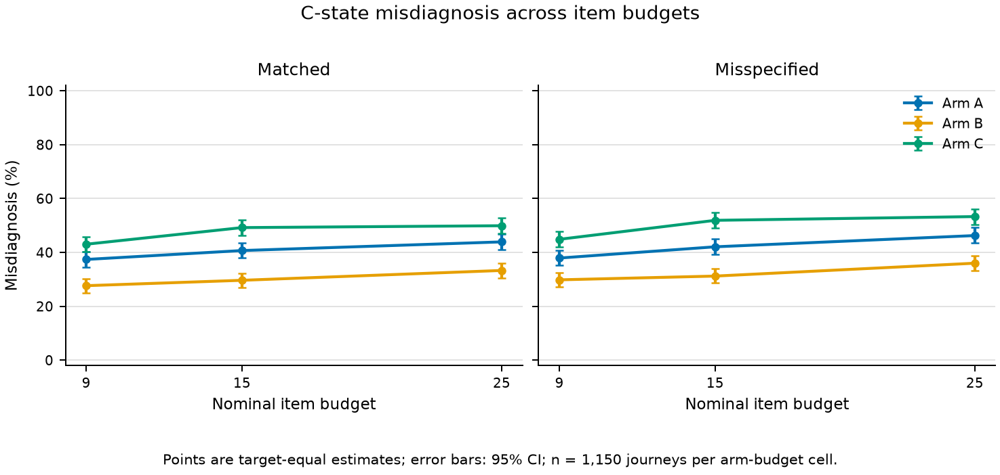
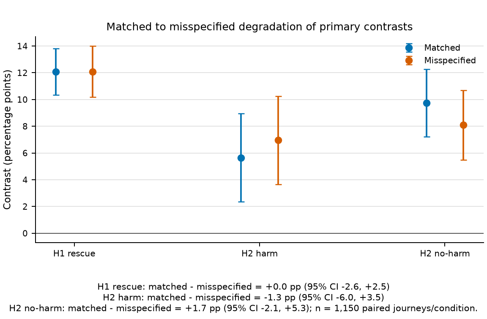

<!-- JOURNAL TITLE OPTIONS
TITLE_CANDIDATE_1: Terminal Accuracy Without Confident Convergence: A Finite-Budget Simulation Audit of Model-Defined Chemistry Diagnosis
TITLE_CANDIDATE_2: From Diagnostic Evidence to Model-Defined Remediation: Auditing Probe Selection and Stopping Under Item Budgets
TITLE_CANDIDATE_3: Budget-Limited Confident Convergence in a Chemistry Diagnostic System: Programmatic Evidence and Response-Channel Stress Tests
SELECTED_TITLE: Terminal Accuracy Without Confident Convergence: A Finite-Budget Simulation Audit of Model-Defined Chemistry Diagnosis
-->

# Terminal Accuracy Without Confident Convergence: A Finite-Budget Simulation Audit of Model-Defined Chemistry Diagnosis

## Structured Abstract

**Background:** Short diagnostic budgets can yield a correct model-defined terminal
ranking without satisfying the system's confidence-based stopping rule.

**Objective:** We audited prerequisite-probe selection, fixed insertion, one
pre-specified generator perturbation, and the terminal-versus-convergence gap.
Secondary analyses examined Persona-v2 answer-state shifts and robustness and
supply-constrained prescription mapping.

**Methods:** The implementation-bound simulation crossed 27 chemistry targets, four
states, three arms, 50 paired replicates, and two generators (32,400 intended
journeys). Arms shared noise streams. Ten thousand target-stratified paired
bootstraps quantified Monte Carlo uncertainty conditional on this fixed catalog, not
population uncertainty. Secondary analyses used 50 persona clusters and a two-target
prescription model.

**Results:**

At 15 items, adaptive P-state correct convergence was 148/1,150 (12.9%) versus 9/1,150 (0.8%) for the local ladder; the paired difference was 12.1 points (95% CI 10.3% to 13.8%). H1 was partially supported because the adaptive rate missed the frozen 50% criterion. At nine items, fixed insertion minus adaptive C-state misdiagnosis was 5.7 points, while adaptive minus local was 9.7 points; H2 was not supported. H3 was supported, and the direction-only H4 check passed.

Persona v2 (50 clusters; 3/6 providers eligible): conditional-accuracy shift=13.4% (95% CI 9.8% to 17.4%); blind agreement=48.0%-79.0%, answer-category/canonical-complete-output stability=95.0%/11.7%, failure=0.0%; Automated error coding was unavailable: GPT judge failed and Claude judge was unavailable; pairwise judge agreement was not estimable. P2 (retrospectively byte-anchored illustration; historical order unproven; 2 targets/8 rows/3 sources): mismatched minutes A/B/C=3.298/4.030/1.525; Arm-C structural-failure fraction=0.500.

**Conclusions:** Prerequisite probes improved one contrast without reliable confident
convergence, and adaptive selection failed no-harm. In this implementation, terminal
accuracy overstated operational convergence. The study does not estimate learning
gains, efficacy, or human behavioral validity.

## Keywords

adaptive diagnosis; computerized adaptive testing; chemistry education; Bayesian
learner model; simulation audit; stopping rule; prerequisite probe; model-defined
remediation

## 1. Introduction

Adaptive educational systems often compress a sequence of responses into a mastery
score and then use that score to choose the next item or learning resource. That loop
is useful when the only decision is whether to continue practice. It is less adequate
when the downstream action depends on *which model-defined condition* produced the
same observed error. A low score may route a learner to a prerequisite explanation,
a worked reasoning bridge, or a direct introduction to the target concept. If the
diagnostic distinction is weak, a confident-looking posterior can spend a limited
learning budget on the wrong type of resource.

This paper studies that measurement problem inside a local Shanghai high-school
chemistry diagnostic and recommendation implementation. The system represents a target
concept using four model-defined diagnostic states: mastered (M), prerequisite gap
(P), reasoning-chain instability (C), and unlearned target knowledge (U). The labels
are operational hypotheses in an engineered model. They are not clinical categories,
psychometric traits established in people, or observations of human participants.
Their value depends on whether the response channel can distinguish them within the
item budget used by the product and whether a state-conditioned downstream action is
better aligned with the model-defined resource role than a state-agnostic one.

The motivating tension is straightforward. For local target questions, the
production likelihoods assigned to P and U differ by only 0.10. With arbitrarily many
independent observations under the model, that gap can identify the states. With 9,
15, or 25 questions, the posterior may rank P first without crossing the production
confidence and gap thresholds. A prerequisite question creates a different response
channel that separates P from U more strongly, but the same channel can blur C with
other states. The design question is therefore not whether prerequisite questions
are informative in general. It is when a selector should expose that channel and
whether the stopping rule recognizes the evidence it accumulates.

The study was developed in response to known instrument limitations, including
multiple-choice-heavy evidence, sparse multi-step and media-dependent coverage, and
uncertain mapping from observed error to downstream remediation. These limitations
make a large efficacy claim premature. They also create a legitimate audit question:
under a fixed model, catalog, and response budget, where does state recovery fail and
how does that failure constrain later decisions? We call this a **budget-limited
confident-convergence failure**. The phrase is deliberately finite and operational.
It does not assert structural or asymptotic impossibility.

The primary programmatic experiment addresses four frozen hypotheses. H1 asks whether
belief-triggered expected information gain (EIG) improves correct confident
convergence for P relative to a local-only ladder while also reaching a minimum
absolute rate. H2 asks whether a fixed prerequisite quota harms C relative to the
adaptive policy and whether the adaptive policy stays within a no-harm margin relative
to the local-only ladder. H3 is a subordinate adaptive-selection sanity check. H4
tests whether the predicted H1 and H2 directions persist under one frozen family of
generator misspecification. The decisions, supports, exclusions, seeds, and interval
procedures were fixed before the confirmatory run.

Two later components are separated from that primary evidence. Persona v2 estimates
paired deficit-control shifts in answer-state composition under controlled prompts and
tests blind response robustness across language-model providers. Target-policy
compliance is available only as a sparse six-row descriptive check. Persona v2 is an
independent response-channel stress test, not an enlargement of the programmatic
sample. P2 illustrates how diagnostic posteriors map to model-defined mechanically
mismatched selected minutes and missed available-supply minutes within a small trusted
resource library. Neither component is allowed to alter H1-H4.

The research questions are:

1. Does belief-triggered prerequisite probing improve P-state correct confident
   convergence over a local-only fixed ladder at the frozen item budget?
2. Does fixed-quota prerequisite probing raise C-state misdiagnosis relative to the
   adaptive arm, while the adaptive arm remains within the frozen no-harm margin
   relative to the local-only arm?
3. Do adaptive terminal accuracy and convergence-time advantages appear on the full
   target set, and do the predicted directions persist under the declared generator
   perturbation?
4. On the same target support, how large is the gap between a correct terminal argmax
   and a correct confidence-based stop, and what selector behavior is associated with
   that gap?
5. Secondarily and exploratorily, how do paired deficit-control answer states shift
   under controlled prompts, and how robust are blind terminal responses across
   providers and repeats?
6. Secondarily and illustratively, how do fixed diagnostic posteriors map to
   mechanically mismatched selected minutes, missed available-supply minutes, and
   structural failure under constrained trusted-video supply?

The contributions are correspondingly bounded. First, we provide a repository-frozen,
pre-observation comparison of a belief-triggered selector, a local-only ladder, and a
fixed prerequisite quota using the local product implementation. Second, we preserve
paired random streams and co-report with-replacement stress and no-repeat
common-support estimates rather than choosing
the more favorable view. Third, we separate terminal classification from confident
convergence and show that they can lead to very different assessments of readiness.
Fourth, we expose the dependence of the findings on one declared response generator
and on a narrow chemistry catalog. Finally, we pre-specify bounded secondary analyses
of answer-state robustness and supply-constrained prescription mapping without
allowing either to revise the primary decisions.

The claim boundary is central: this is a simulation-only audit of model-defined
diagnostic states. It does not estimate learning gains, does not establish educational
efficacy, does not establish human behavioral validity, and does not claim that the
tested target set represents an entire chemistry curriculum.

## 2. Related Work

### 2.1 Adaptive testing and simulation

Computerized adaptive testing has a long history of using current evidence to select
more informative items. Robbins-Monro formulations, early work on measurement
efficiency, and educational applications established the basic logic well before the
present system [@lord1971; @weiss1982; @weiss-kingsbury1984]. Methodological work shows
why simulations are useful for comparing item-selection rules when the latent
condition and response process are controlled [@barrada2010; @han2018]. Selection and
termination are distinct design choices, and stopping rules can change test-length
and precision tradeoffs [@choi-grady-dodd2011]. The present study does not offer EIG
as a new algorithm. It audits whether an existing selector aligns with a separately
implemented confidence-based stopping rule.

Simulation can make failure modes observable because the generating state is known.
It can also create circular evidence when the same likelihood family drives both the
generator and inference. We address, but cannot eliminate, that risk by separating a
matched generator from a pre-specified misspecified generator and by reporting the
change between them. This design tests sensitivity to one perturbation family; it
does not approximate the full range of response behavior found outside the model.

### 2.2 Learner models, confidence, and longitudinal scope

Bayesian knowledge tracing and related learner models estimate changing knowledge
from observed practice [@corbett-anderson1994; @pelanek2017]. Our primary experiment
uses Bayesian updating but freezes the generating diagnostic state within each
journey. It therefore evaluates state recovery during one diagnostic session, not
knowledge acquisition, forgetting, transfer, or retention. The distinction matters:
a model may update a posterior coherently without its state labels corresponding to
stable constructs outside the simulator.

Spaced-practice scheduling concerns a different decision horizon
[@tabibian2019; @ye2022]. The product's FSRS-inspired projection draws on documented
software [@fsrs-repository; @anki-fsrs-manual], but neither scheduling research nor
software documentation validates the likelihoods or stopping thresholds audited here.

### 2.3 Language-model response simulation

Recent studies use language models to instantiate diverse response profiles, review
question items, or test tutoring agents [@lu-wang2024; @liu2024; @jin2025; @wu2025;
@scarlatos2025]. This work demonstrates a potentially useful evaluation instrument,
but it also makes construct boundaries essential. Surface plausibility and prompt
compliance do not show that a response process matches human behavior. Direct tests
of simulated tutoring dialogue have reinforced the distinction between apparent
student-like language and substantive behavioral validity [@scarlatos2026].

Persona v2 therefore has two conditions with different purposes. Controlled prompts
estimate paired deficit-control shifts in answer-state composition; the collapsed
target map prevents general target-policy compliance from being a confirmatory
outcome. Blind response robustness removes target labels and tests cross-provider
consistency, technical failure, abstention, and repeat stability. Neither condition
assigns independent sample status to provider calls or produces an authenticity
score. Cross-model adjudication is automated descriptive coding, not a human reference
standard.

### 2.4 From diagnostic output to remediation

A diagnostic posterior becomes educationally consequential only when it changes an
action. In the current system, P, C, and U would route to different resource roles.
This makes terminal state accuracy incomplete: policies may differ in stopping,
abstention, or allocation of limited minutes. Budgeted coverage supplies a relevant
algorithmic reference point [@khuller-moss-naor1999], but P2 makes no approximation
claim. It maps posterior-conditioned demand onto a fixed trusted library and reports
model-defined mechanically mismatched selected and missed available-supply minutes.
The illustration is a resource audit, not an optimizer benchmark or efficacy study.

## 3. Methods

### 3.1 System boundary and trusted catalog

The audited system serves Shanghai high-school chemistry. Its knowledge graph has 135
nodes, but the deterministic confirmatory catalog opened only 27 targets that passed
service, scoring, mapping, media, and content-family gates. A mechanical prerequisite
census admitted 23 of those targets to H1 and H2. Four targets lacked the required
prerequisite-family structure and remained in the full descriptive and H3 grid but
not in H1 or H2.

Questions were separated at both item and content-family levels. Two local families
per target were reserved for held-out scoring and removed from all administered
pools. Held-out responses were never used for posterior updates. The programmatic
runner imported the production mastery updater and selector, so Bayesian updates,
EIG scores, eligibility rules, and stopping behavior were the same implementations
used by the local product. The experiment did not alter the official question bank or
the frozen H1-H4 decisions.

### 3.2 Model-defined diagnostic states and response channels

For a target-local item of difficulty \(d\), the production model assigns the
state-wise probability of a correct response as

\[
P(Y=1\mid M,P,C,U)=(0.90,\ \gamma+0.10,\ 0.70-0.20d,\ \gamma),
\]

where \(\gamma=0.25\) for multiple-choice items and \(0.03\) for numeric items. The
local P and U channels therefore differ by 0.10. A prerequisite item uses

\[
P(Y_{pre}=1\mid M,P,C,U)=(0.90,\ \gamma,\ 0.80,\ 0.75).
\]

This second vector creates more separation between P and U, while making a correct
prerequisite response compatible with several other states. The posterior starts
uniform within each journey and updates after each observation. A terminal decision
is the posterior argmax in the frozen M, P, C, U order. Correct confident convergence
requires both the correct argmax and the production confidence and posterior-gap
conditions. Exhausting the item budget is distinct from satisfying those conditions.

The prerequisite likelihood vector updates the target-state posterior directly. We
therefore call the comparison a *probe-channel comparison*. It is not evidence that
information propagated through the knowledge graph.

### 3.3 Programmatic design and item-selection arms

The intention-to-simulate grid crossed 27 targets, four fixed truth states, three
arms, 50 replicates, and two response-generator conditions, yielding 32,400 planned
journeys. A maximum 25-item run supplied frozen views at budgets 9, 15, and 25. When
confidence was reached before a nominal view, the posterior and convergence time were
carried forward without increasing the administered count.

The three arms were:

- **Arm A, belief-triggered EIG.** At each decision, all eligible local and
  prerequisite candidates competed under the production EIG selector. The production
  stopping rule was evaluated after every posterior update.
- **Arm B, local-only ladder.** Requested difficulties cycled through 0.25, 0.50,
  0.75, and 1.00, with only local items eligible.
- **Arm C, fixed prerequisite quota.** Arm C used the same ladder but replaced every
  third position with a prerequisite item through position 24.

Fixed-arm ties were resolved deterministically by absolute difficulty distance,
family identifier, and item identifier. After all unseen eligible families were
exhausted, the frozen family-epoch replenishment rule permitted reuse. Repetition was
measured and disclosed rather than treated as independent evidence.

The confirmatory hypotheses and decision branches were frozen before collection.
H1 required both an Arm-A correct-convergence rate of at least 0.50 at budget 15 and a
strictly positive lower confidence bound for A minus B. H2 required a strictly
positive lower bound for C minus A C-state misdiagnosis at budget 9 and an upper bound
below the +0.05 no-harm margin for A minus B. H3 required the adaptive arm not to lose
terminal accuracy and not to take longer to converge than B. H4 required the H1
rescue and H2 fixed-quota harm point directions to remain positive under the frozen
misspecified generator.

### 3.4 Response generators, pairing, and sparse-pool estimands

The matched generator sampled from the production probabilities. The misspecified
generator instead drew item-level slip from a uniform 0.05 to 0.20 distribution,
guess from a uniform 0.15 to 0.35 distribution, and one replicate-level
ability offset from a zero-centered normal distribution with standard deviation 0.05,
clipped to the interval -0.10 to 0.10. Inference retained its production constants in
both conditions. Generator parameters were not passed to the posterior updater.

Arms were paired within target, truth state, generator condition, and replicate. They
shared response-noise streams. The two held-out family outcomes were generated from
seeds without an arm component, ensuring identical held-out draws for A, B, and C.
This pairing reduced irrelevant Monte Carlo variation and permitted direct arm
contrasts.

H1 and H2 used two pre-declared population views. The primary empirical stress view
retained all 23 eligible targets and allowed the frozen family-replenishment behavior.
The sensitivity view restricted analysis to the budget-specific three-arm common
support on which every arm could complete without family repetition. That support
contained nine targets at budget 9, four at budget 15, and one at budget 25. Both
views were required regardless of direction.

Arm C could not construct the fixed prerequisite schedule for four targets. This
produced 1,600 structural failures in the intended grid. Those failures were retained
in the lifecycle and excluded uniformly from estimands under the frozen rule; they
were not reclassified after results were known.

### 3.5 Outcomes, support identity, and statistical analysis

At each nominal budget, outcomes included correct confident convergence, converged
misdiagnosis, terminal argmax accuracy, the four-by-four terminal and decision
confusion matrices, convergence time, held-out Brier score, administered count, exact
item repeats, and family repeats. Held-out Brier under the matched generator is an
internal calibration diagnostic only.

Programmatic intervals used exactly 10,000 target-stratified paired-replicate
percentile bootstrap resamples. Replicate identifiers were resampled with replacement
within each target, while all arm observations for a sampled replicate remained
paired. Contrasts were computed inside each resample. Reported quantities include the
numerator, denominator, target count, weighting rule, and 95% interval.

The target catalog was fixed and was not resampled. These intervals therefore
describe Monte Carlo uncertainty across simulator replicate streams conditional on
the audited catalog. They are not uncertainty intervals for a population of chemistry
targets, learners, schools, or diagnostic systems.

Support identity was checked before interpreting any pair. The 27-target full-set
terminal and convergence rates are compared only with each other. The 23-target
eligible-set rates are likewise paired only with the same eligible support. The
original artifact registry encodes support through metric names, target counts,
denominators, and predicates rather than a dedicated target-set hash. The final binder
reconstructs and binds a dedicated target-set hash before insertion; portability still
depends on preserving the frozen target roster used for that reconstruction.

The terminal-versus-convergence comparison and selector composition analysis were not
confirmatory hypotheses. They are labeled post-hoc throughout. They may suggest a
selector-stopping mismatch, but they cannot change the H1-H4 decisions.

### 3.6 Persona-v2 dual-condition protocol

Persona v2 is frozen separately from the programmatic study. Its independent cluster
is `persona_id`, represented in prose as 50 persona clusters. Each cluster contains a
paired deficit row and control row. Provider, prompt condition, deficit-control arm,
and item are repeated observations within the cluster; the analysis therefore treats
provider as a repeated measure alongside the other within-cluster factors. Calls,
retries, individual item answers, and model outputs are not independent sample units.

The grid crosses 25 failure anchors with low and high response-noise settings. The
controlled manipulation condition exposes a general observable error policy and uses
four calibration items, but its primary outcomes are the four-state answer composition
(correct, incorrect, abstention, and technical/schema failure), conditional accuracy
among complete non-abstaining answers, and paired deficit-control shifts. The blind
condition removes target misconception labels and target options, reuses the
calibration items, and adds up to 21 family-distinct diagnostic items. It reports
terminal-answer agreement, technical/schema failure, abstention, and two distinct
repeat measures: answer-category agreement and canonical complete-output equality.
The latter requires equality of the complete normalized response, not only the selected
answer category.
Every response uses a text-only modality.

Before provider observation, exact item/failure/option consensus was achieved for
only 6 of 100 calibration rows. Because that coverage was below the frozen minimum,
target-misconception hit rate was removed from the confirmatory Persona-v2 analysis.
General target-policy compliance is therefore not a confirmatory outcome. The six
mapped rows may appear only as a sparse descriptive target-option check with an
explicit denominator and support hash. This degradation is an input fact, not a
provider outcome.

The smoke pilot uses two providers and five clusters, is stored separately, and is
excluded from every main estimate. Main collection attempts six frozen providers.
Intervals use a 10,000-resample persona-cluster bootstrap that preserves all repeated
provider, prompt-condition, deficit-control, and item observations for a sampled
cluster. The pre-specified cross-model LLM adjudication protocol would receive blind
public prompts and candidate outputs without target labels, correct options, or
mapping status. Allowed labels include unknown and insufficient evidence. Actual judge
completion is bound in Results; unavailable judges produce no labels or pairwise
statistic. Any agreement and disagreement examples are descriptive, and no realism or
authenticity score is formed.

For temporal and model reproducibility, the machine-bound Persona-v2 surface reports
the exact requested and observed model IDs. It also binds the phase first-observation time and immutable provider-event window,
temperature, absence of explicit `top_p` and seed parameters,
and each provider's token, timeout, worker-cap, retry, breaker, backoff, cooldown, and
jitter settings. Provider-event times are execution-evidence timestamps, not per-response timestamps.
The requested-versus-observed comparison applies only when a response supplied a model
identifier; an unavailable response is not treated as a model-identity match.

### 3.7 Illustrative prescription analysis

The parent validated library contains 68 trusted node-chunk assignments spanning 59
unique chunks across 13 nodes. Its exact overlap with the H1-H4 target catalog is much smaller: two
fixed target strata, eight eligible chunks, and three distinct physical video sources.
This overlap, not the parent-library count, defines the P2 analytic support.

P2 used matched-generator, budget-15 posteriors for Arms A, B, and C and one-hot truth
vectors for the oracle. Within each arm, 16 equally weighted truth pairs crossed the
50 replicate margins from each target, giving 40,000 product-form integration terms
per arm and 160,000 fixed profile rows overall. Each truth cell has weight 1/16 and
each within-cell cross-product term has weight 1/2,500. These terms are not independent
observations, joint learners, or an empirical prevalence distribution.

Under one 600-second budget, the greedy selector maximized posterior-weighted binary
coverage of target-state role slots, with physical-source deduplication and saturation
after the first compatible chunk. It ranked feasible choices by marginal utility per
second, then marginal utility, shorter duration, and lexicographic chunk identifier.
This is a problem-specific heuristic related to budgeted coverage
[@khuller-moss-naor1999]; no approximation guarantee, optimality claim, or exact-solver
comparison is made.

Reported fields separate mechanically mismatched selected minutes, missed
available-supply minutes, unused budget, and diagnostic structural failure. For Arm C,
one of the two target nodes is structurally invalid at budget 15; it is masked without
reading or imputing its stored belief, and the bound report must retain the exact
failed-node numerator and denominator (1/2). `unobtainable_supply_minutes` remains
null, not zero, because the frozen model defines no role-compatible P/U dose. The
finite-design means are illustrative; the 160,000 integration terms receive no learner
sample size or population-inferential confidence interval. Any separately bound
bootstrap interval describes simulator Monte Carlo variability only.

### 3.8 AI-assisted research workflow

Generative AI systems supported study-design critique, software implementation and
testing, simulation execution, data analysis, figure generation, and adversarial
manuscript review, and generated the initial full manuscript prose and subsequent
revision proposals. AI-generated suggestions did not enter the confirmatory result
surface by prose alone. H1-H4 claims were checked against frozen analysis rules,
immutable hashes, machine-generated metric records, and targeted regression tests.
Provider outputs in Persona v2 are research objects and are distinct from AI
assistance used to conduct the work.

The named systems were OpenAI Codex (GPT-5.6 Sol) for implementation, testing,
analysis scaffolding, and manuscript drafting/revision, and Anthropic Claude Code (Claude Opus 4.8)
for project-direction critique, review, and revision proposals.
These names describe the recorded tools used in this working version; the final
submission must preserve the exact product/version strings required by the selected
journal and the actual session records.

The human author set project direction and claim boundaries and retains responsibility
for source review, result interpretation, journal-policy compliance, and final text.
AI systems were not treated as authors, participants, or external reference standards.
Before submission, the human author must critically review and revise the complete
manuscript and the disclosure must name the systems, model versions, and uses in the
formula required by the selected journal. No credential, private prompt, or
machine-local location is part of the manuscript evidence surface.

## 4. Results

### 4.1 Execution integrity and analysis populations

32400 intended journeys; 30800 valid; 1600 structural failures; 0 schema-invalid. The full analysis support contains 27 targets; the mechanically eligible H1/H2 support contains 23 targets.

All results below are simulated finite-budget estimates. Matched and misspecified
conditions remain separate. H1-H4 decisions are reproduced from the frozen decision
rules rather than reassigned from the apparent favorability of a point estimate.
Their intervals describe Monte Carlo uncertainty conditional on the fixed 27-target
catalog or stated subset; they do not support target-population or learner-population
inference.

| Hypothesis | Frozen decision |
|---|---|
| H1 | partially supported |
| H2 | not supported |
| H3 | supported |
| H4 | direction-only check passed |

### 4.2 Prerequisite-gap rescue and reasoning-chain harm

At budget 15 on the 23-target eligible stress support, Arm A P-state correct confident convergence was 148/1,150 (12.9%) (95% CI 11.2% to 14.5%), versus 9/1,150 (0.8%) (95% CI 0.3% to 1.3%) for Arm B. The paired A-minus-B contrast was 139/1,150 paired contrast; 12.1 percentage points; 95% CI 10.3% to 13.8%. The direction favored adaptive probing, but the Arm-A rate did not reach the frozen 50% threshold. H1 was partially supported.

On the no-repeat common support (4 targets; 200 paired cases), Arm A was 1/200 (0.5%) and Arm B was 0/200 (0.0%); the contrast was 1/200 paired contrast; 0.5 percentage points; 95% CI 0.0% to 1.5%. This jointly changed support-and-repeat estimand was much weaker, so its difference from the broad estimate cannot be attributed to repetition alone.

At budget 9 on the 23-target support, C-state misdiagnosis was 430/1,150 (37.4%) for Arm A, 318/1,150 (27.7%) for Arm B, and 495/1,150 (43.0%) for Arm C. C minus A was 65/1,150 paired contrast; 5.7 percentage points; 95% CI 2.3% to 9.0%. A minus B was 112/1,150 paired contrast; 9.7 percentage points; 95% CI 7.2% to 12.3%, exceeding the frozen +5-point no-harm margin. H2 was not supported.

On the 9-target no-repeat common support, the corresponding rates were 188/450 (41.8%) for A, 128/450 (28.4%) for B, and 197/450 (43.8%) for C. C minus A was 9/450 paired contrast; 2.0 percentage points; 95% CI -3.3% to 7.6%, whereas A minus B was 60/450 paired contrast; 13.3 percentage points; 95% CI 9.1% to 17.6%.

### 4.3 Adaptive sanity check and misspecification

On the full 27-target matched set at budget 15, Arm A exceeded Arm B in terminal accuracy by 542/5,400 paired contrast; 10.0 percentage points; 95% CI 8.9% to 11.2%. Median time to confidence was 8 items for A (95% CI 8 to 8) and 11 items for B (95% CI 10 to 11). H3 was supported; this is an implementation sanity check, not an algorithmic novelty claim.

Under the misspecified generator, P-state A minus B was 139/1,150 paired contrast; 12.1 percentage points; 95% CI 10.2% to 14.0%; C-state C minus A was 80/1,150 paired contrast; 7.0 percentage points; 95% CI 3.7% to 10.3%; and C-state A minus B was 93/1,150 paired contrast; 8.1 percentage points; 95% CI 5.5% to 10.7%. Matched minus misspecified degradation was 0.0 points for H1 (95% CI -2.6% to 2.5%), -1.3 points for fixed-quota harm (95% CI -6.0% to 3.5%), and 1.7 points for adaptive minus local (95% CI -2.1% to 5.3%). H4 was supported under its direction-only rule; this does not establish robustness to untested generator families.

### 4.4 Same-support terminal and convergence estimates

Terminal argmax accuracy and correct confident convergence answered different
questions. The former asked whether the correct state had the largest posterior at
the end of the budget. The latter additionally required the production confidence
and posterior-gap thresholds. Table 1 preserves support identity for both views.

| Pair ID | Support | Terminal accuracy | Correct convergence | Difference |
|---|---|---:|---:|---:|
| full_27_terminal_vs_correct_convergence | full | 1,131/1,350 (83.8%) | 168/1,350 (12.4%) | 71.3 pp |
| eligible_23_terminal_vs_correct_convergence | eligible | 1,043/1,150 (90.7%) | 148/1,150 (12.9%) | 77.8 pp |

Rows are not cross-compared: target-set hashes are full_27_terminal_vs_correct_convergence=726c098269012f371cc36c25691c1dfd4ad6963e2f0bba14a32c888d5fdbca9e; eligible_23_terminal_vs_correct_convergence=1220fc5d686df0d5b2d866c4587dca5423fafe60d73f1f8465f6ed703e85c016.
The full-support difference is arithmetic only because no dedicated bootstrap interval is bound. The eligible-support difference retains its paired interval.
Post-hoc selector composition on the eligible support averaged 1.43 direct and 11.95 prerequisite items by budget 15; prerequisite share was 83.8% (95% CI 82.6% to 84.9%). This selector-stopping mismatch is exploratory and does not revise H1.

The selector composition is interpreted only as a post-hoc mechanism clue. We refer
to the observed pattern as a **selector-stopping mismatch**. It is exploratory, not a
randomized mechanism test, and it does not revise H1.

### 4.5 Persona-v2 dual-condition results

Formal Persona-v2 main results use 50 persona_id clusters, provider as a repeated measurement, text-only modality, and disjoint pilot/main task rosters. These simulated response-channel estimates measure instruction following and robustness, not human behavioral validity. 3/6 providers were eligible for both controlled and blind aggregates.

**Formal collection provenance.**

Phase first observation: 2026-07-15T20:27:09.136311Z UTC; immutable provider-event ledgers span 2026-07-15T20:27:10.561439Z to 2026-07-15T23:20:17.307143Z UTC. These ledger times are execution-evidence timestamps, not per-response timestamps.
All requests set temperature=0, with no explicit top_p or seed. Every response that supplied a model ID matched its requested ID. Worker counts below are per-provider caps.
Requested / observed model IDs: deepseek: deepseek-v4-pro / deepseek-v4-pro; glm: glm-4-plus / glm-4-plus; kimi: moonshot-v1-128k / moonshot-v1-128k; minimax: abab6.5s-chat / abab6.5s-chat; doubao: doubao-seed-2-0-mini-260428 / doubao-seed-2-0-mini-260428; tongyi: qwen-max / qwen-max.
Provider policies: deepseek: initial/truncation retry caps 1,024 / 2,048 (observed: 1,024, 2,048); 90 s; workers=4; attempts=4; breaker=3; backoff=1-30 s; cooldown=120 s; jitter=25%; glm, kimi, minimax, tongyi: initial/truncation retry caps 512 / 1,024 (observed: 512); 60 s; workers=4; attempts=3; breaker=3; backoff=1-30 s; cooldown=120 s; jitter=25%; doubao: initial/truncation retry caps 1,024 / 2,048 (observed: 1,024); 120 s; workers=2; attempts=4; breaker=3; backoff=2-60 s; cooldown=180 s; jitter=25%.

| Provider lifecycle | Records | Controlled status | Blind status | Exclusion reasons |
|---|---:|---|---|---|
| deepseek | 4/1,528 | controlled excluded | blind excluded | minimum_complete_clusters, repeated_failure |
| glm | 4/1,528 | controlled excluded | blind excluded | minimum_complete_clusters, repeated_failure |
| kimi | 1,528/1,528 | controlled eligible | blind eligible | none |
| minimax | 56/1,528 | controlled excluded | blind excluded | minimum_complete_clusters, repeated_failure |
| doubao | 1,528/1,528 | controlled eligible | blind eligible | none |
| tongyi | 1,528/1,528 | controlled eligible | blind eligible | none |

| Controlled paired outcome | Oriented effect | 95% cluster CI | Denominator |
|---|---:|---:|---|
| Conditional answer accuracy | 13.4% (control_minus_deficit) | 9.8% to 17.4% | paired persona denominator 50-50 |
| Correct-response yield | 14.2% (control_minus_deficit) | 10.7% to 18.0% | paired persona denominator 50-50 |
| Incorrect-response yield | 13.2% (deficit_minus_control) | 9.5% to 17.2% | paired persona denominator 50-50 |
| Abstention yield | 1.0% (deficit_minus_control) | 0.3% to 1.8% | paired persona denominator 50-50 |
| Technical/schema-failure yield | 0.0% (deficit_minus_control) | 0.0% to 0.0% | paired persona denominator 50-50 |

| Blind/exploratory outcome | Estimate | Denominator/interval |
|---|---:|---|
| Blind technical/schema failure rate | 0.0% | 0.0% to 0.0% |
| Blind terminal exact agreement | 48.0% to 79.0% | 3 provider pairs; 100 paired terminal subjects each |
| Repeat answer-category stability | 95.0% | 87.0% to 100.0% |
| Repeat canonical complete-output stability | 11.7% | 3.7% to 20.4% |
| Automated error coding (exploratory) | Unavailable | Automated error coding was unavailable: GPT judge failed and Claude judge was unavailable; pairwise judge agreement was not estimable |

<figure class="persona-v2-composite">
<svg xmlns="http://www.w3.org/2000/svg" class="persona-v2-summary" viewBox="0 0 1000 320" role="img" aria-label="Persona-v2 controlled paired shifts, blind terminal agreement, and repeat stability"><rect width="1000" height="320" fill="#ffffff" /><rect x="8" y="8" width="526" height="304" rx="6" fill="#ffffff" stroke="#aab4be" stroke-width="1" /><rect x="546" y="8" width="446" height="146" rx="6" fill="#ffffff" stroke="#aab4be" stroke-width="1" /><rect x="546" y="166" width="446" height="146" rx="6" fill="#ffffff" stroke="#aab4be" stroke-width="1" /><text x="26" y="36" font-family="Arial, Helvetica, sans-serif" font-size="20" fill="#17212b" font-weight="700">A  Controlled paired shifts</text><text x="26" y="58" font-family="Arial, Helvetica, sans-serif" font-size="16" fill="#52616f">Oriented effect (95% CI); n=50 clusters</text><line x1="208.0" y1="72" x2="208.0" y2="276" stroke="#d8dee5" stroke-width="1" /><text x="208.0" y="296" font-family="Arial, Helvetica, sans-serif" font-size="16" fill="#52616f" text-anchor="middle">0%</text><line x1="358.0" y1="72" x2="358.0" y2="276" stroke="#d8dee5" stroke-width="1" /><text x="358.0" y="296" font-family="Arial, Helvetica, sans-serif" font-size="16" fill="#52616f" text-anchor="middle">10%</text><line x1="508.0" y1="72" x2="508.0" y2="276" stroke="#d8dee5" stroke-width="1" /><text x="508.0" y="296" font-family="Arial, Helvetica, sans-serif" font-size="16" fill="#52616f" text-anchor="middle">20%</text><text x="26" y="97" font-family="Arial, Helvetica, sans-serif" font-size="16" fill="#17212b">Conditional accuracy</text><line x1="355.5" y1="92" x2="468.8333333333333" y2="92" stroke="#26727a" stroke-width="4" stroke-linecap="round" /><circle cx="409.66666666666663" cy="92" r="6" fill="#173f5f" /><text x="516" y="97" font-family="Arial, Helvetica, sans-serif" font-size="16" fill="#17212b" text-anchor="end" font-weight="700">13.4%</text><text x="26" y="139" font-family="Arial, Helvetica, sans-serif" font-size="16" fill="#17212b">Correct yield</text><line x1="368.0" y1="134" x2="478.0" y2="134" stroke="#26727a" stroke-width="4" stroke-linecap="round" /><circle cx="420.5" cy="134" r="6" fill="#173f5f" /><text x="516" y="139" font-family="Arial, Helvetica, sans-serif" font-size="16" fill="#17212b" text-anchor="end" font-weight="700">14.2%</text><text x="26" y="181" font-family="Arial, Helvetica, sans-serif" font-size="16" fill="#17212b">Incorrect yield</text><line x1="350.5" y1="176" x2="465.5" y2="176" stroke="#26727a" stroke-width="4" stroke-linecap="round" /><circle cx="405.5" cy="176" r="6" fill="#173f5f" /><text x="516" y="181" font-family="Arial, Helvetica, sans-serif" font-size="16" fill="#17212b" text-anchor="end" font-weight="700">13.2%</text><text x="26" y="223" font-family="Arial, Helvetica, sans-serif" font-size="16" fill="#17212b">Abstention yield</text><line x1="213.0" y1="218" x2="235.5" y2="218" stroke="#26727a" stroke-width="4" stroke-linecap="round" /><circle cx="223.0" cy="218" r="6" fill="#173f5f" /><text x="516" y="223" font-family="Arial, Helvetica, sans-serif" font-size="16" fill="#17212b" text-anchor="end" font-weight="700">1.0%</text><text x="26" y="265" font-family="Arial, Helvetica, sans-serif" font-size="16" fill="#17212b">Tech/schema failure</text><line x1="208.0" y1="260" x2="208.0" y2="260" stroke="#26727a" stroke-width="4" stroke-linecap="round" /><circle cx="208.0" cy="260" r="6" fill="#173f5f" /><text x="516" y="265" font-family="Arial, Helvetica, sans-serif" font-size="16" fill="#17212b" text-anchor="end" font-weight="700">0.0%</text><text x="562" y="36" font-family="Arial, Helvetica, sans-serif" font-size="20" fill="#17212b" font-weight="700">B  Blind terminal agreement</text><text x="562" y="57" font-family="Arial, Helvetica, sans-serif" font-size="16" fill="#52616f">3/6 eligible providers; n=100/pair</text><text x="562" y="86" font-family="Arial, Helvetica, sans-serif" font-size="16" fill="#17212b">Doubao / Kimi</text><rect x="718" y="73" width="215" height="13" fill="#edf1f4" /><rect x="718" y="73" width="103.2" height="13" fill="#2a9d8f" /><text x="974" y="86" font-family="Arial, Helvetica, sans-serif" font-size="16" fill="#17212b" text-anchor="end" font-weight="700">48.0%</text><text x="562" y="111" font-family="Arial, Helvetica, sans-serif" font-size="16" fill="#17212b">Doubao / Tongyi</text><rect x="718" y="98" width="215" height="13" fill="#edf1f4" /><rect x="718" y="98" width="169.85" height="13" fill="#2a9d8f" /><text x="974" y="111" font-family="Arial, Helvetica, sans-serif" font-size="16" fill="#17212b" text-anchor="end" font-weight="700">79.0%</text><text x="562" y="136" font-family="Arial, Helvetica, sans-serif" font-size="16" fill="#17212b">Kimi / Tongyi</text><rect x="718" y="123" width="215" height="13" fill="#edf1f4" /><rect x="718" y="123" width="113.95" height="13" fill="#2a9d8f" /><text x="974" y="136" font-family="Arial, Helvetica, sans-serif" font-size="16" fill="#17212b" text-anchor="end" font-weight="700">53.0%</text><text x="562" y="194" font-family="Arial, Helvetica, sans-serif" font-size="20" fill="#17212b" font-weight="700">C  Repeat stability</text><text x="562" y="215" font-family="Arial, Helvetica, sans-serif" font-size="16" fill="#52616f">Provider-equal; 20 repeat pairs/provider</text><text x="562" y="245" font-family="Arial, Helvetica, sans-serif" font-size="16" fill="#17212b">Answer category</text><rect x="754" y="231" width="179" height="15" fill="#edf1f4" /><rect x="754" y="231" width="170.05" height="15" fill="#3274a1" /><text x="974" y="245" font-family="Arial, Helvetica, sans-serif" font-size="16" fill="#17212b" text-anchor="end" font-weight="700">95.0%</text><text x="562" y="282" font-family="Arial, Helvetica, sans-serif" font-size="16" fill="#17212b">Canonical complete output</text><rect x="754" y="268" width="179" height="15" fill="#edf1f4" /><rect x="754" y="268" width="20.883333333333333" height="15" fill="#c8553d" /><text x="974" y="282" font-family="Arial, Helvetica, sans-serif" font-size="16" fill="#17212b" text-anchor="end" font-weight="700">11.7%</text></svg>
<figcaption>Figure. Compact Persona-v2 composite: controlled paired shifts, blind terminal agreement, and answer-category versus canonical complete-output repeat stability. Detailed provider panels remain in the supplement.</figcaption>
</figure>

The table and compact figure report paired controlled answer-state composition and
shifts, blind agreement, technical/schema failure, abstention, and repeat stability
only for lifecycle-eligible provider cells. General target-policy compliance is not a
confirmatory outcome; the six mapped rows remain sparse descriptive evidence. These
are response-channel stress estimates, not evidence of human behavioral validity.

### 4.6 Illustrative prescription results

Illustrative P2 is supply-bound to 13 nodes and 68 trusted exact node-chunk assignments spanning 59 unique chunks. The fixed analytic overlap contains 2 targets, 8 candidate rows, and 3 physical sources under a 600-second analytic budget. This illustrative analysis does not estimate learning benefit or external remediation quality.

The specification-bound legacy output is retrospectively byte-anchored; its historical computation order is not cryptographically proven.

P/U role-compatible dose minutes are unavailable and remain null because the frozen library has no role-compatible dose definition for those states.

| Arm | Mechanically mismatched selected min | Missed available-supply min | Diagnostic structural-failure node fraction |
|---|---:|---:|---:|
| oracle | 0.000 | 0.000 | 0.000 |
| A | 3.298 | 0.824 | 0.000 |
| B | 4.030 | 0.756 | 0.000 |
| C | 1.525 | 2.067 | 0.500 |

Arm C's failed-node fraction of 0.500 is a diagnostic structural failure and is retained intention-to-treat; it is not a zero-cost prescription. Missed available-supply minutes instead quantify supply scarcity within the fixed trusted library.

The parent boundary is 13 nodes, 68 trusted node-chunk assignments, and 59 unique
chunks, but the analytic support is fixed at two target strata, eight eligible chunks,
and three physical sources. The
bound report must preserve the 160,000 weighted product-form integration rows as
non-independent analytic terms, retain Arm C's one structurally failed target out of
two, and leave `unobtainable_supply_minutes` null. These fields do not measure learning
benefit, harm, or learner-population effects.

## 5. Discussion

### 5.1 Main interpretation

The primary experiment produced a mixed but informative result. Belief-triggered
probing improved correct P convergence relative to a local-only ladder on the broad
eligible stress support, yet the absolute convergence rate remained far below the
frozen criterion and weakened further on the small no-repeat common support. This is
not a successful
identification result masked by a strict criterion. It is evidence that the tested
response channels and stopping thresholds did not reliably turn a directional
advantage into an operationally confident diagnosis.

The C-state result is equally important. Fixed prerequisite insertion was worse than
the adaptive policy on the primary support, matching the motivating direction. But
the adaptive policy was itself materially worse than the local-only ladder, and the
pre-specified no-harm condition failed. A narrative focused only on C minus A would
therefore be incomplete. The three-arm design shows that avoiding a rigid quota did
not imply that the adaptive policy was harmless.

H3 confirmed that the adaptive path improved aggregate terminal accuracy and reached
confidence sooner than the local ladder across the full state grid. That advantage
coexisted with poor P correct convergence. Aggregate adaptive efficiency can therefore
hide a state-specific failure that matters for remediation routing. The direction-only
H4 check found that the predicted rescue and fixed-quota harm directions survived one
generator perturbation, but the design provides no warrant to generalize beyond that
family.

### 5.2 Why terminal accuracy is insufficient

The largest descriptive finding was not an arm contrast but the same-support gap
between terminal state ranking and confident convergence. On both the full and
eligible supports, Arm A usually placed P first by the end of budget 15. It rarely
satisfied the confidence-based stop. A product surface that displays only the argmax
could therefore present a decisive-looking label where the production rule itself
would continue gathering evidence or abstain.

The post-hoc selector composition makes this gap plausible. EIG repeatedly chose the
prerequisite response channel, so the issue was not simply that the selector ignored
prerequisite evidence. Selection optimized expected posterior information one item at
a time; stopping required an absolute confidence and separation condition. Those
objectives need not agree under sparse, overlapping likelihoods. The result motivates
a direct audit of selector and stopper compatibility, not a claim that EIG is
generally defective.

Operationally, three outputs should remain distinct: the terminal argmax, whether the
confidence rule passed, and the action taken when it did not. A remediation system can
use abstention, ask a different response type, or route to a low-risk general review
when confidence remains insufficient. The present study does not establish which
fallback improves outcomes, but it identifies the cases where a fallback is needed
under the model.

### 5.3 Implications for response-channel stress testing

Programmatic simulation supplies known generating states and exact pairing, which
makes it the strongest evidence in this paper for internal behavior. It cannot answer
whether language models or people produce the assumed response patterns. Persona v2
addresses only the narrower question of response-channel robustness: do controlled
prompts produce paired deficit-control shifts in answer-state composition, and do
blind outputs remain stable when target labels are hidden?

The two-condition separation prevents prompted answer-state shifts from being
mistaken for construct validity. Even strong shifts would not show that the induced
errors resemble those of students. Blind cross-provider agreement may reveal a stable
model response pattern; it would not establish that the pattern is educationally
correct. Clustering by persona rather than by call prevents retries and repeated
provider observations from inflating the sample size.

The pre-observation mapping degradation also changes what can be claimed. With exact
consensus for only six calibration rows, a target-specific misconception hit rate
would be dominated by ambiguous mappings. Removing it from the confirmatory family
before provider observation is more informative than forcing a noisy metric into the
paper. It leaves correctness, abstention, schema validity, terminal agreement, and
answer-category and canonical complete-output repeat stability as separate
response-channel outcomes. Only lifecycle-eligible providers contribute to these
aggregates; their exact roster and denominators are reported rather than generalized
to all attempted providers.

### 5.4 From posterior error to prescription constraints

The downstream prescription illustration expresses diagnostic error in a finite time
currency: mechanically mismatched selected minutes and missed available-supply
minutes. This translation is model-defined. It does not show that watching a selected
chunk changes knowledge or that unmodeled P/U demand equals zero.

The parent library spans 13 nodes, 68 trusted node-chunk assignments, and 59 unique
chunks, but the exact analytic overlap contains only two target strata, eight chunks,
and three physical sources. Arm C's
inability to open one of those two nodes is a structural failure, not a zero-cost
outcome. The illustration therefore retains structural failure, missed available
supply, unused budget, and the null unobtainable-dose field separately. Its weighted
product-form terms are integration points, not learners or prevalence observations.

### 5.5 Claim boundaries and use

The results support an internal audit conclusion: selection efficiency, terminal
accuracy, and confidence-based convergence are separable, and a policy that improves
one state contrast can still violate a no-harm condition for another state. They do
not support a claim that a learner was correctly diagnosed, that a remediation was
pedagogically appropriate, or that the system improved achievement.

The intended use of the evidence is engineering triage. It identifies where richer
response channels, better item-family coverage, altered stopping logic, or explicit
abstention deserve evaluation before a larger intervention study. It also supplies a
locally machine-reproducible negative result conditional on the fixed catalog: under
the tested finite budgets, the P state remained poorly converged despite an adaptive
rescue contrast. This is the precise sense in which the study documents
budget-limited confident-convergence failure.

## 6. Limitations

1. **Simulation-only evidence.** No human participants contributed outcome data. The
   known generating state makes internal error analysis possible but cannot establish
   how people respond, learn, or interpret the diagnostic interface.

2. **Model circularity.** The matched generator uses the production likelihoods that
   inference assumes. The misspecified generator breaks that identity only through
   one frozen slip, guess, and ability-offset family, leaving many plausible response
   processes untested.

3. **Static diagnostic state.** The generating state is fixed within a journey. The
   experiment does not model knowledge acquisition, forgetting, transfer, or
   retention, and its results should not be read as longitudinal evidence.

4. **Text-only and multiple-choice-heavy channels.** The programmatic catalog is
   dominated by binary scored traces, and Persona v2 is explicitly text-only. The
   study does not test diagrams, experimental apparatus, open derivations, or the
   long-chain reasoning formats that motivated part of the instrument audit.

5. **Narrow curricular coverage.** Only 27 of 135 graph nodes enter the full
   programmatic grid, and only 23 satisfy the prerequisite-family gate for H1/H2.
   Important chemistry domains and difficult integrated problems remain outside the
   evidence base. Targets were fixed rather than sampled, so bootstrap intervals
   quantify simulator Monte Carlo uncertainty conditional on this catalog; they are
   not target-population, learner-population, or school-population intervals.

6. **Sparse pools and structural failures.** Family replenishment permits repeats in
   the broad stress estimand, while no-repeat common supports are small. Arm C also
   fails structurally for four targets, so comparisons are not uniformly available
   across the catalog.

7. **Stopping-rule specificity.** The terminal-versus-convergence gap depends on the
   current posterior confidence and separation thresholds. Other calibrated stopping
   rules may behave differently, and the post-hoc explanation has not been tested by
   a frozen stopping-rule intervention.

8. **No human reference labels for response coding.** The Persona-v2 protocol
   specified blind automated adjudication with unknown and insufficient-evidence
   options. The bound Results section reports whether any judge completed; no pairwise statistic
   is formed without two distinct model families, and unavailable coding remains
   unavailable. Automated coding cannot establish semantic correctness or behavioral
   realism.

9. **Independent item responses.** Persona-v2 elicits each response through a frozen
   response-channel protocol rather than modeling persistent memory or learning
   across a session. The independent unit is 50 persona clusters, with provider,
   prompt condition, deficit-control arm, and item repeated within cluster; provider
   calls are not additional units. Provider models and APIs can also drift over time,
   limiting temporal reproducibility despite recorded model identities.

10. **Constrained prescription supply.** The illustrative remediation analysis is
    drawn from a 13-node library with 68 trusted node-chunk assignments spanning 59
    unique chunks, but its exact support is only two target strata, eight chunks, and
    three physical sources. Product-form integration
    terms are not learners, and mechanically mismatched selected or missed
    available-supply minutes describe only this fixed utility model.

## 7. Conclusion

This study audited a chemistry diagnostic system at the point where answer evidence
becomes a model-defined state decision. Belief-triggered prerequisite probing produced
a positive P-state rescue contrast relative to a local-only ladder, but it did not
reach the frozen absolute convergence criterion. Fixed prerequisite insertion harmed
C relative to the adaptive arm, while the adaptive arm also failed its no-harm test
against the local ladder. Aggregate adaptive accuracy and speed improved, and the two
directions required by the pre-specified direction-only H4 check persisted under one
declared misspecification family.

Most importantly, correct terminal state ranking and correct confident convergence
were far apart on both legitimate supports. That gap, together with the post-hoc
selector composition, motivates treating item selection and stopping as separate
objects of evaluation. In the audited implementation, the terminal argmax should not
be converted into a precise remediation label without also reporting whether the
separate confidence rule passed.

Persona-v2 response-channel estimates and the P2 prescription illustration extend the
audit with secondary robustness and supply-bound downstream-cost evidence. They do not
revise the frozen H1-H4 decisions, establish human behavioral validity, or turn this
internal simulation audit into a study of human learning.

## Declarations

### Ethics and participant involvement

No human participants were enrolled and no personally identifying information was
collected for the experiments reported here. Programmatic responses and language-model
outputs are labeled as simulated evidence. Any future study involving students or
human raters requires a separate ethics, consent, and data-governance determination.

### Data and code availability

The local reproducibility package contains frozen analysis plans, versioned source,
hash-bound input manifests, deterministic seeds, raw simulated response envelopes,
metric registries, figure artifacts, and regression tests. Public release remains
gated on a repository destination and a rights review covering question text, video
metadata, and derived artifacts. Any submission statement must name the approved
repository or access procedure. Credentials, private provider payloads, and material
without distribution rights are excluded.

### Funding

No external funding is declared for this study.

### Competing interests

The author declares no competing financial interest. The audited system was developed
within the same project, which creates an investigator-interest risk addressed through
pre-observation freezing, negative-result retention, and machine-bound reporting.

### Declaration of Generative AI and AI-assisted Technologies

Generative AI and AI-assisted technologies were used for study-design critique,
software implementation and testing, simulation execution, data analysis, figure
generation, drafting and revising prose, and adversarial manuscript review. They
generated the initial full manuscript prose and subsequent revision proposals. Outputs
were checked against frozen contracts, source artifacts, automated tests, and stated
claim boundaries. The systems were OpenAI Codex (GPT-5.6 Sol) and Anthropic Claude
Code (Claude Opus 4.8). AI systems were not treated as authors, human participants, or
external reference standards. Before
submission, the human author must critically review and revise the complete manuscript
and assume responsibility for its accuracy, integrity, interpretation, policy
compliance, and final wording. The final disclosure must name the systems and model
versions and follow the selected journal's current formula without implying that one
publisher policy applies universally.

## References
